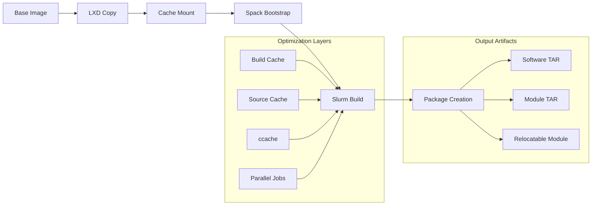

<div align="center">
<a href="https://www.vantagecompute.ai/">
  
</a>
</div>
<div align="center">

# Slurm Factory

[](LICENSE)
[](https://python.org)
[](https://pypi.org/project/slurm-factory/)
[](https://linuxcontainers.org/lxd)


</div>

A modern Python CLI tool that automates building **truly relocatable**, **optimized** Slurm workload manager packages using LXD containers and the Spack package manager. Built for rapid deployment across diverse HPC environments with intelligent caching, portable modules, and bootstrapped compiler workflows.

## 🚀 Quick Start

### Option 1: Install from PyPI (Recommended)

```bash
# Install LXD
sudo snap install lxd && sudo lxd init

# Install slurm-factory from PyPI
pip install slurm-factory

# Build latest Slurm
slurm-factory build
```

### Option 2: Install from Source

```bash
# Install LXD and UV
sudo snap install lxd && sudo lxd init
curl -LsSf https://astral.sh/uv/install.sh | sh

# Clone and setup
git clone https://github.com/vantagecompute/slurm-factory.git
cd slurm-factory && uv sync

# Build latest Slurm
uv run slurm-factory build
```

Extract and deploy packages on your HPC cluster!

## 🔧 Requirements

- **LXD**: Container runtime for isolated builds
- **Python 3.10+**: Runtime environment (automatically configured)
- **50GB+ disk space**: For build caches and package storage
- **4+ CPU cores**: Recommended for parallel compilation (8+ cores optimal)
- **16GB+ RAM**: Minimum for large builds (32GB+ recommended)

### Automatic Dependencies

slurm-factory automatically manages build dependencies within containers:
- **Spack**: Installed and configured in build containers
- **Build Toolchain**: GCC, CMake, autotools (containerized)
- **CUDA/ROCm**: Optional GPU support packages (when building with GPU features)

## ✨ Key Features

- **🎯 Truly Relocatable**: Bootstrapped compiler workflow with no host dependencies, proper RPATH configuration, and Spack-built runtime libraries
- **🔄 Portable Modules**: Deploy the same package to different filesystem paths using runtime environment variables (no LD_LIBRARY_PATH pollution)
- **⚡ Optimized Build Pipeline**: Intelligent caching with base images, build-cache reuse, and parallel compilation
- **📦 Smart Packaging**: Runtime libraries built fresh, build tools as externals for minimal footprint
- **🖥️ Multi-Architecture**: CPU-specific optimizations and optional GPU support (CUDA/ROCm)
- **🏗️ Container Isolation**: Reproducible builds in clean LXD container environments
- **🚀 Ultra-Fast Rebuilds**: Persistent build-cache and source-cache for subsequent builds (>10x speedup)
- **✅ CI/CD Integration**: Optional verification mode with `--verify` flag for automated testing

## 📋 Supported Versions

| Version | Status | Package Size (CPU) | Package Size (GPU) |
|---------|---------|--------------------|--------------------|
| 25.05   | ✅ Latest | ~2-5GB | ~15-25GB |
| 24.11   | ✅ LTS | ~2-5GB | ~15-25GB |
| 23.11   | ✅ Stable | ~2-5GB | ~15-25GB |
| 23.02   | ✅ Legacy | ~2-5GB | ~15-25GB |

## 📚 Documentation

Visit our comprehensive documentation site:
**[vantagecompute.github.io/slurm-factory](https://vantagecompute.github.io/slurm-factory)**

- **[Installation Guide](https://vantagecompute.github.io/slurm-factory/installation/)**: Detailed setup instructions
- **[Architecture Overview](https://vantagecompute.github.io/slurm-factory/architecture/)**: How slurm-factory works
- **[Deployment Guide](https://vantagecompute.github.io/slurm-factory/deployment/)**: Production deployment workflows
- **[API Reference](https://vantagecompute.github.io/slurm-factory/api-reference/)**: Complete CLI documentation
- **[Troubleshooting](https://vantagecompute.github.io/slurm-factory/troubleshooting/)**: Common issues and solutions

## 🛠️ Basic Usage

### Building Packages

```bash
# Build latest Slurm (CPU-optimized, truly relocatable)
uv run slurm-factory build

# Build specific version with GPU support
uv run slurm-factory build --slurm-version 24.11 --gpu

# Build minimal Slurm (no OpenMPI, smaller size)
uv run slurm-factory build --minimal

# Build with CI verification (for testing relocatability)
uv run slurm-factory build --minimal --verify

# Build with verbose output
uv run slurm-factory --verbose build
```

**Note**: All builds now use a bootstrapped compiler workflow (gcc@13.3.0 +binutils) and generate self-contained Lmod modules with proper RPATH configuration, eliminating any host dependencies for true relocatability.

### Deploying Packages

```bash
# Extract software package on target system
sudo mkdir -p /opt/slurm
sudo tar -xzf ~/.slurm-factory/builds/slurm-25.05-software.tar.gz -C /opt/slurm

# Extract module files to system module directory
sudo tar -xzf ~/.slurm-factory/builds/slurm-25.05-module.tar.gz -C /usr/share/lmod/lmod/modulefiles

# Load the module (module name will be generated by Spack, typically slurm/version)
module load slurm/25.05
```

### Deploying Relocatable Packages

```bash
# Traditional deployment (specific path)
sudo mkdir -p /opt/slurm
sudo tar -xzf ~/.slurm-factory/builds/slurm-25.05-software.tar.gz -C /opt/slurm
sudo tar -xzf ~/.slurm-factory/builds/slurm-25.05-module.tar.gz -C /usr/share/lmod/lmod/modulefiles

# Load module (uses default path from build)
module load slurm/25.05

# Alternative deployment (custom path)  
sudo mkdir -p /shared/apps/slurm-25.05
sudo tar -xzf ~/.slurm-factory/builds/slurm-25.05-software.tar.gz -C /shared/apps/slurm-25.05
sudo tar -xzf ~/.slurm-factory/builds/slurm-25.05-module.tar.gz -C /usr/share/lmod/lmod/modulefiles

# Load module with custom path
export SLURM_INSTALL_PREFIX=/shared/apps/slurm-25.05/software
module load slurm/25.05

# Verify relocated installation
which srun squeue  # Points to custom path
echo $SLURM_ROOT   # Shows: /shared/apps/slurm-25.05/software
```

### Output Structure

```
~/.slurm-factory/
├── builds/                      # Build outputs
│   ├── 25.05/
│   │   ├── slurm-25.05-software.tar.gz    # Relocatable software (~2-5GB)
│   │   └── slurm-25.05-module.tar.gz      # Dynamic modules (~4KB)
│   └── 24.11/
├── spack-buildcache/            # Persistent binary cache (speeds rebuilds)
├── spack-sourcecache/           # Source downloads cache
└── binary_index/                # Build index for dependency tracking
```

## 🏗️ Build Process Flow

slurm-factory uses an optimized multi-stage build process designed for speed and reproducibility:



### Stage 1: Base Container Preparation
- **Base Image**: Ubuntu 24.04 LXD container with essential build tools
- **Cache Strategy**: Reuse base container across builds for consistency
- **Mount Points**: Persistent cache directories for build and source artifacts

### Stage 2: Dependency Resolution & Optimization
- **External Tools**: Use system build tools (cmake, autotools, compilers) as externals
- **Runtime Libraries**: Build essential runtime deps (munge, json-c, curl, openssl) fresh
- **Smart Externals**: Leverage system packages for build-only dependencies

### Stage 3: Accelerated Compilation
- **Build Cache**: Reuse compiled packages across builds (>10x speedup for subsequent builds)
- **Source Cache**: Persistent source downloads to avoid re-fetching
- **ccache**: Compiler cache for faster C/C++ compilation  
- **Parallel Jobs**: 4 concurrent build jobs for faster compilation
- **Hardlink Views**: Efficient package views using hardlinks instead of symlinks

### Stage 4: Relocatable Package Assembly  
- **Dynamic Prefix**: Modules support `SLURM_INSTALL_PREFIX` environment variable override
- **Self-Contained**: All runtime dependencies included in package
- **Portable Modules**: Lmod modules work across different filesystem layouts

### Runtime vs Build Dependencies Strategy

slurm-factory uses an intelligent dependency classification system for optimal package size and performance:

#### 🔧 **Built Fresh (Runtime Critical)**
These libraries are compiled specifically for your target architecture and included in the package:
- **munge** - Authentication daemon (security critical)
- **json-c** - JSON parsing (runtime linked)  
- **curl** - HTTP client for REST API (runtime linked)
- **openssl** - SSL/TLS encryption (runtime linked)
- **hwloc** - Hardware topology (runtime linked)
- **readline, ncurses** - Interactive CLI support
- **lz4, zlib-ng** - Compression libraries (runtime linked)

#### ⚙️ **External Tools (Build Only)**  
System packages used during build but not needed at runtime:
- **cmake, autotools** - Build system tools
- **gcc, compilers** - Compilation toolchain
- **pkg-config** - Build configuration
- **bison, flex** - Parser generators
- **System libraries** - glib, libxml2, dbus (system-level abstractions)

This strategy results in:
- **Minimal Runtime Footprint**: Only essential libraries included
- **Maximum Performance**: Architecture-specific optimizations for runtime deps
- **Fast Builds**: Leverage fast system packages for build tools
- **High Portability**: Self-contained runtime with minimal system requirements

## 🎯 Relocatable Module Architecture

slurm-factory generates **relocatable Lmod modules** that can be deployed to different filesystem locations without modification:

### Dynamic Prefix Support
```bash
# Default behavior - uses build-time installation path
module load slurm/25.05

# Custom installation path - override at runtime  
export SLURM_INSTALL_PREFIX=/shared/apps/slurm
module load slurm/25.05

# Works with any filesystem layout
export SLURM_INSTALL_PREFIX=/opt/hpc/slurm-25.05
module load slurm/25.05
```

### Module Implementation
The generated modules use **environment variable substitution** with **fallback support**:

```lua
-- Dynamic paths that adapt to installation location
prepend_path("PATH", "${SLURM_INSTALL_PREFIX:-/opt/slurm/software}/bin")
prepend_path("LD_LIBRARY_PATH", "${SLURM_INSTALL_PREFIX:-/opt/slurm/software}/lib")

-- Runtime configuration with override capability
setenv("SLURM_ROOT", "${SLURM_INSTALL_PREFIX:-/opt/slurm/software}")
setenv("SLURM_PREFIX", "${SLURM_INSTALL_PREFIX:-/opt/slurm/software}")
```

### Benefits
- **🚀 Deploy Once, Use Anywhere**: Same package works across different clusters
- **🔧 Runtime Flexibility**: Change installation path without rebuilding
- **📦 Distribution Ready**: Perfect for software repositories and container images
- **⚡ Zero Downtime**: Update installation paths without rebuilding modules
- **🏢 Multi-Tenant**: Different users/projects can use different installation locations

## 🎯 Use Cases

- **🏢 Multi-Site Deployments**: Deploy same package across clusters with different filesystem layouts
- **☁️ Cloud HPC**: Relocatable packages for elastic infrastructure and container orchestration
- **📦 Software Distribution**: Create redistributable Slurm packages for software repositories
- **🔄 Migration & Upgrades**: Move installations without rebuilding or reconfiguration
- **🏫 Research Computing**: Standardized deployments across heterogeneous cluster environments
- **⚡ DevOps Automation**: Scriptable deployments with runtime path configuration

## 🤝 Contributing

We welcome contributions! See our [Contributing Guide](https://vantagecompute.github.io/slurm-factory/contributing/) for details on:

- Setting up development environment
- Code style guidelines  
- Submitting pull requests
- Reporting issues

## 📄 License

This project is licensed under the Apache License 2.0 - see the [LICENSE](LICENSE) file for details.

Copyright 2025 Vantage Compute Corporation

Licensed under the Apache License, Version 2.0 (the "License");
you may not use this file except in compliance with the License.
You may obtain a copy of the License at

    http://www.apache.org/licenses/LICENSE-2.0

Unless required by applicable law or agreed to in writing, software
distributed under the License is distributed on an "AS IS" BASIS,
WITHOUT WARRANTIES OR CONDITIONS OF ANY KIND, either express or implied.
See the License for the specific language governing permissions and
limitations under the License.

## 🆘 Support

- **Issues**: [GitHub Issues](https://github.com/vantagecompute/slurm-factory/issues)
- **Discussions**: [GitHub Discussions](https://github.com/vantagecompute/slurm-factory/discussions)
- **Email**: [james@vantagecompute.ai](mailto:james@vantagecompute.ai)

---

**Made with ❤️ by [Vantage Compute](https://vantagecompute.ai)**
