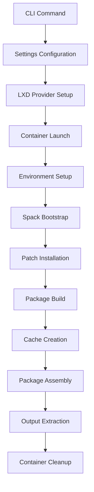

# Slurm Factory Architecture

This document provides a comprehensive overview of slurm-factory's **modern Python architecture**, optimization strategies, and implementation details focused on performance, maintainability, and portability.

## Overview

slurm-factory is designed around a **modular Python architecture** using Typer CLI framework, comprehensive exception handling, and **relocatable package generation** through an optimized build pipeline. The architecture prioritizes build speed through intelligent caching, dependency classification, and container reuse while producing portable packages that work across diverse HPC environments.

## Module Architecture

```
slurm_factory/
├── main.py           # Typer CLI application & global options
├── builder.py        # Build orchestration & LXD management  
├── config.py         # Pydantic settings & cache management
├── constants.py      # Enums, templates & build configuration
├── spack_yaml.py     # Dynamic Spack configuration generation
├── utils.py          # LXD operations & package creation
└── exceptions.py     # Custom exception hierarchy
```

### Module Responsibilities

#### `main.py` - CLI Interface
- **Typer Application**: Modern CLI with auto-completion and help generation
- **Global Options**: Project management, verbose logging, environment configuration
- **Command Routing**: Routes to `build()` and `clean()` commands with validated parameters
- **Context Management**: Passes configuration and state between commands

#### `builder.py` - Build Orchestration
- **Build Process**: Coordinates LXD container lifecycle and Spack operations
- **Instance Management**: Creates, configures, and manages build containers
- **Progress Tracking**: Rich console output with build status and progress indicators
- **Error Handling**: Comprehensive error capture and user-friendly error messages

#### `config.py` - Configuration Management
- **Pydantic Settings**: Type-safe configuration with environment variable support
- **Cache Directory Management**: Automatic creation and validation of cache directories
- **Project Settings**: LXD project configuration and build output management

#### `exceptions.py` - Error Hierarchy
- **Structured Exceptions**: Custom exception classes for different error types
- **Error Context**: Rich error messages with actionable debugging information
- **Exception Propagation**: Proper error handling throughout the application stack

## Core Architecture Flow

```
┌─────────────────────────────────────────────────────────────┐
│              Modern Python CLI Application                 │
├─────────────────────────────────────────────────────────────┤
│  Typer CLI   │ Settings  │ Exception │ Rich Console        │
│  (main.py)   │ (config)  │ Handling  │ Output              │
├─────────────────────────────────────────────────────────────┤
│           Build Orchestration (builder.py)                 │
│  LXD Project │ Container │ Spack     │ Package Assembly    │
│  Management  │ Lifecycle │ Config    │ & Validation        │
├─────────────────────────────────────────────────────────────┤
│              Optimized Build Pipeline                      │
│  Base Image  │ LXD Copy  │ Cache Mount │ Spack Bootstrap   │
│  (Cached)    │ (Fast)    │ (Persistent)│ (Cached)          │
├─────────────────────────────────────────────────────────────┤
│           Dependency Classification & Build                │
│    External Tools    │    Runtime Libraries Fresh         │
│    (System Pkgs)     │    (Arch-Optimized)               │
├─────────────────────────────────────────────────────────────┤
│              Relocatable Package Assembly                  │
│   Software TAR   │   Module TAR   │  Dynamic Prefix      │
│   (2-25GB)      │   (4KB)        │  (Runtime Override)   │
└─────────────────────────────────────────────────────────────┘
```

## Python Architecture Benefits

### 1. **Type Safety & Validation**
- **Pydantic Models**: Runtime validation of configuration and parameters
- **Enum Classes**: Type-safe Slurm version and build option handling
- **Typer Integration**: Automatic CLI validation and error messages

### 2. **Comprehensive Error Handling**
```python
try:
    build_result = build(ctx, slurm_version, gpu, minimal)
except LXDError as e:
    console.print(f"[red]LXD operation failed: {e}[/red]")
except BuildError as e:
    console.print(f"[red]Build process failed: {e}[/red]")
except SlurmFactoryError as e:
    console.print(f"[red]General error: {e}[/red]")
```

### 3. **Rich User Experience**
- **Progress Indicators**: Real-time build progress with Rich console output
- **Colored Output**: Status-aware colored text for better readability
- **Help System**: Auto-generated help with examples and option validation

## Build Optimization Strategy

### 1. **Container Efficiency**
- **Base Image Reuse**: Single Ubuntu 24.04 base container across all builds
- **LXD Copy Operations**: Fast container duplication instead of fresh installs
- **Persistent Mounts**: Cache directories mounted across container lifecycles

### 2. **Multi-Layer Caching**
```
Build Cache (Binary Packages)
├── spack-buildcache/          # Compiled package binaries
├── spack-sourcecache/         # Downloaded source archives  
├── binary_index/              # Dependency resolution cache
└── ccache/                    # Compiler object cache
```

**Performance Impact:**
- **First Build**: 45-90 minutes (full compilation)
- **Subsequent Builds**: 5-15 minutes (>10x speedup)
- **Cache Hit Ratio**: 80-95% for common dependencies

### 3. **Dependency Classification Strategy**

slurm-factory uses intelligent dependency classification to optimize both build time and package size:

#### **🔧 External Tools (Build-Time Only)**
System packages used during compilation but not included in final package:

```yaml
externals:
  cmake: {spec: "cmake@3.28.3", prefix: "/usr"}
  autoconf: {spec: "autoconf@2.71", prefix: "/usr"}  
  automake: {spec: "automake@1.16.5", prefix: "/usr"}
  gcc: {spec: "gcc@13.3.0", prefix: "/usr"}
  pkg-config: {spec: "pkg-config@0.29.2", prefix: "/usr"}
```

**Benefits:**
- **Fast Builds**: Leverage optimized system packages
- **Reduced Compilation**: No need to rebuild standard tools
- **Smaller Packages**: Build tools excluded from final package

#### **⚡ Runtime Libraries (Fresh Builds)**  
Critical dependencies compiled with architecture-specific optimizations:

```yaml
buildable: true
packages:
  munge:     # Authentication daemon (security critical)
  json-c:    # JSON parsing (runtime linked)
  curl:      # HTTP client for REST API
  openssl:   # SSL/TLS encryption (runtime linked)
  hwloc:     # Hardware topology detection
  readline:  # Interactive CLI support
  lz4:       # Compression (runtime linked)
```

**Benefits:**
- **Performance**: Architecture-specific optimizations (SSE, AVX)
- **Security**: Fresh builds with latest patches
- **Compatibility**: Guaranteed version compatibility with Slurm

### 4. **Compilation Acceleration**

```yaml
spack_config:
  build_jobs: 4              # Parallel compilation
  ccache: true               # Compiler object caching
  build_stage: "/tmp/spack-stage"  # Fast tmpfs builds
  
performance_optimizations:
  parallel_builds: 4         # Concurrent package builds
  compiler_cache: enabled    # C/C++ object caching
  hardlink_views: true       # Fast file operations
  unify_concretizer: true    # Optimal dependency resolution
```

**Impact:**
- **Parallel Compilation**: 4x faster builds on multi-core systems
- **ccache**: 50-80% reduction in C/C++ compilation time
- **Hardlinks**: 10x faster than symlink-based package views

## Relocatable Module Architecture

### Dynamic Prefix Implementation

slurm-factory generates **relocatable Lmod modules** using environment variable substitution:

```lua
-- Dynamic path resolution with fallback
prepend_path("PATH", "${SLURM_INSTALL_PREFIX:-{prefix}}/bin")
prepend_path("LD_LIBRARY_PATH", "${SLURM_INSTALL_PREFIX:-{prefix}}/lib")

-- Runtime configuration
setenv("SLURM_ROOT", "${SLURM_INSTALL_PREFIX:-{prefix}}")
setenv("SLURM_PREFIX", "${SLURM_INSTALL_PREFIX:-{prefix}}")

-- Build metadata for introspection
setenv("SLURM_BUILD_TYPE", "standard build")
setenv("SLURM_VERSION", "25-05-1-1")
```

### Module Context System

```yaml
module_context:
  installation_root: "{prefix}"
  redistributable: true
  supports_relocation: true
  relocation_variable: "SLURM_INSTALL_PREFIX"
```

**Deployment Flexibility:**
```bash
# Default deployment
module load slurm/25.05

# Custom path deployment  
export SLURM_INSTALL_PREFIX=/shared/apps/slurm
module load slurm/25.05

# Container deployment
export SLURM_INSTALL_PREFIX=/app/slurm
module load slurm/25.05
```

## Package Structure & Optimization

### Software Package Architecture

```
slurm-25.05-software.tar.gz (~2-25GB)
├── software/
│   ├── bin/                    # Slurm executables
│   │   ├── srun, sbatch, squeue
│   │   ├── sinfo, scancel, scontrol
│   │   └── salloc, sacct, sreport
│   ├── sbin/                   # Slurm daemons
│   │   ├── slurmd, slurmctld
│   │   ├── slurmdbd, slurmrestd
│   │   └── slurm-wlm-configurator
│   ├── lib/                    # Runtime libraries
│   │   ├── libslurm.so*        # Core Slurm library
│   │   ├── slurm/              # Plugin libraries
│   │   │   ├── accounting_storage_*.so
│   │   │   ├── job_submit_*.so
│   │   │   └── select_*.so
│   │   └── runtime dependencies
│   │       ├── libmunge.so*
│   │       ├── libjson-c.so*
│   │       ├── libcurl.so*
│   │       └── libssl.so*
│   ├── include/               # Development headers
│   │   └── slurm/
│   └── share/                 # Documentation & configs
│       ├── man/
│       └── doc/
```

### Module Package Structure

```
slurm-25.05-module.tar.gz (~4KB)
├── modules/
│   └── slurm/
│       └── 25.05.lua          # Relocatable Lmod module
└── modulefiles/               # Alternative hierarchy
    └── slurm/
        └── 25.05
```

**Module Features:**
- **Relocatable Paths**: Dynamic prefix support
- **Build Metadata**: Version, type, capabilities
- **Conflict Resolution**: Prevents multiple Slurm versions
- **Help Text**: Usage instructions and customization hints

Manages application settings and cache directory structure.

**Settings Class:**
```python
@dataclass
class Settings:
    project_name: str           # LXD project name
    
    @property
    def home_cache_dir(self) -> Path:      # ~/.slurm-factory/
    
    @property 
    def builds_dir(self) -> Path:          # ~/.slurm-factory/builds/
    
    @property
    def spack_buildcache_dir(self) -> Path: # ~/.slurm-factory/spack-buildcache/
    
    @property
    def spack_sourcecache_dir(self) -> Path: # ~/.slurm-factory/spack-sourcecache/
```

**Directory Structure:**
```
~/.slurm-factory/
├── builds/                 # Built packages output
├── spack-buildcache/       # Spack binary cache  
└── spack-sourcecache/      # Spack source cache
```

### 4. Constants and Configuration (`constants.py`)

Defines all build constants, paths, and script templates.

**Supported Slurm Versions:**
```python
SLURM_VERSIONS = {
    "25.05": "25-05-1-1",
    "24.11": "24-11-6-1", 
    "23.11": "23-11-11-1",
    "23.02": "23-02-7-1",
}
```

**Container Paths:**
```python
CONTAINER_CACHE_DIR = "/opt/slurm-factory-cache"
CONTAINER_PATCHES_DIR = "/srv/global-patches"
CONTAINER_SPACK_PROJECT_DIR = "/root/spack-project"
CONTAINER_SLURM_DIR = "/opt/slurm"
CONTAINER_BUILD_OUTPUT_DIR = "/opt/slurm-factory-cache/builds"
```

**Script Templates:**
- Cache setup scripts
- Patch installation scripts
- Spack environment setup
- Build and package creation scripts

### 5. Spack Configuration (`spack_yaml.py`)

Handles Spack environment configuration and YAML generation.

**Key Functions:**
- **generate_yaml_string()**: Creates Spack environment YAML
- Package specification and variant management
- Compiler configuration
- Build optimization settings

## Container Architecture

### LXD Integration

slurm-factory uses the `craft-providers` library for LXD container management.

**Container Lifecycle:**
```
Base Image (ubuntu:24.04) → Base Instance Creation → 
Build Instance Launch → Setup & Build → Package Extraction → Cleanup
```

**Base Instance Strategy:**
- Reusable base instances with common dependencies
- 90-day expiry for automatic cleanup
- Cached Spack installations for faster builds

**Build Instance Isolation:**
- Unique instances per build to prevent conflicts
- Automatic cleanup after successful builds
- Resource limits and security constraints

### Container Environment

**Image Configuration:**
- **Base Image**: Ubuntu 24.04 LTS
- **Remote**: ubuntu (official images)
- **Architecture**: x86_64 (primary), ARM64 (experimental)

**Mounted Directories:**
```
Host                          Container
~/.slurm-factory/             → /opt/slurm-factory-cache/
```

**Container Setup Process:**
1. Cloud-init configuration and boot
2. Package manager updates
3. Development tools installation
4. Spack bootstrap and setup
5. Cache directory configuration
6. Patch file installation

## Build Process Architecture

### Phase 1: Environment Preparation

**Cache Setup:**
```bash
# Create cache directories with proper permissions
mkdir -p /opt/slurm-factory-cache/{spack-buildcache,spack-sourcecache,builds}
chmod -R 755 /opt/slurm-factory-cache/
```

**Patch Installation:**
```bash
# Install Slurm package patches
mkdir -p /srv/global-patches/
# Copy slurm_prefix.patch and package.py
```

### Phase 2: Spack Bootstrap

**Spack Installation:**
```bash
# Clone and configure Spack
git clone -b v1.0.0 https://github.com/spack/spack.git /opt/spack
source /opt/spack/share/spack/setup-env.sh
```

**Environment Setup:**
```yaml
# spack.yaml configuration
spack:
  specs:
  - slurm@{version} ^openmpi ^pmix
  concretizer:
    unify: true
  config:
    build_stage: /tmp/spack-stage
```

### Phase 3: Slurm Compilation

**Build Process:**
```bash
# Create Spack environment
spack env create slurm-{version}
spack env activate slurm-{version}

# Install dependencies and Slurm
spack install slurm@{version}

# Create build cache
spack buildcache create --unsigned slurm
```

**Optimization Features:**
- Architecture-specific optimizations
- Parallel compilation
- Dependency caching
- Build cache reuse

### Phase 4: Package Creation

**Software Package:**
```bash
# Create software tarball
spack location -i slurm | tar -czf slurm-{version}-software.tar.gz
```

**Module Files:**
```bash
# Generate Environment Modules
spack module tcl refresh
tar -czf slurm-{version}-modules.tar.gz modules/
```

## Data Flow Architecture

### Build Data Flow



### Cache Data Flow


## Storage Architecture

### Host Storage Layout

```
~/.slurm-factory/
├── builds/                     # Final build outputs
│   ├── 25.05/
│   │   ├── slurm-25.05-software.tar.gz
│   │   └── slurm-25.05-modules.tar.gz
│   └── 24.11/
├── spack-buildcache/           # Binary package cache
│   ├── build_cache/
│   └── _pgp/
└── spack-sourcecache/          # Source code cache
    ├── archive/
    └── git/
```

### Container Storage Layout

```
Container Filesystem:
├── /opt/spack/                 # Spack installation
├── /opt/slurm-factory-cache/   # Mounted host cache
├── /srv/global-patches/        # Patch files
├── /root/spack-project/        # Build environment
├── /opt/slurm/                 # Slurm installation
└── /srv/build-output/          # Package staging
```

## Performance Architecture

### Build Optimization

**Parallel Processing:**
- Multi-core compilation via Spack
- Parallel dependency builds
- Container resource allocation
- I/O optimization with NVMe

**Caching Strategy:**
- **Source Cache**: Downloaded source archives
- **Build Cache**: Compiled binary packages
- **Container Cache**: Reusable base instances
- **Incremental Builds**: Dependency reuse

### Resource Management

**Memory Optimization:**
- Container memory limits
- Spack memory usage controls
- Garbage collection strategies
- Build staging optimization

**Storage Optimization:**
- Compressed package formats
- Cache size management
- Automatic cleanup policies
- Efficient file transfer

## Security Architecture

### Container Security

**Isolation Boundaries:**
- Process isolation via LXD
- Filesystem namespace isolation
- Network namespace isolation
- User namespace mapping

**Security Controls:**
- Resource limits and quotas
- AppArmor/SELinux profiles
- Capability restrictions
- Read-only system mounts

### Build Security

**Source Verification:**
- Checksum validation for downloads
- Trusted package repositories
- Reproducible build environments
- Build artifact integrity

**Access Control:**
- User-specific cache directories
- Container process ownership
- Secure temporary directories
- Permission management

## Scalability Architecture

### Horizontal Scaling

**Multi-Host Deployment:**
- Distributed LXD clusters
- Shared storage backends
- Build farm coordination
- Load balancing strategies

**Parallel Builds:**
- Concurrent build instances
- Resource pool management
- Build queue management
- Result aggregation

### Vertical Scaling

**Resource Scaling:**
- Dynamic CPU allocation
- Memory scaling policies
- Storage expansion
- Network bandwidth management

## Integration Architecture

### CI/CD Integration

**Pipeline Integration:**
```yaml
# GitHub Actions example
- name: Build Slurm Package
  run: |
    uv run slurm-factory build --slurm-version 25.05
    # Upload artifacts
```

**Automation Points:**
- Triggered builds on version updates
- Automated testing and validation
- Package deployment automation
- Notification and monitoring

### Deployment Integration

**Package Deployment:**
```bash
# Extract to target system
tar -xzf slurm-25.05-software.tar.gz -C /opt/
tar -xzf slurm-25.05-modules.tar.gz -C /usr/share/modules/

# Configure environment
module load slurm/25.05
```

**System Integration:**
- Module system compatibility
- Shared filesystem deployment
- Configuration management
- Service orchestration

## Error Handling Architecture

### Build Error Recovery

**Error Categories:**
- Container launch failures
- Network connectivity issues
- Compilation errors
- Resource exhaustion

**Recovery Strategies:**
- Automatic retry with exponential backoff
- Container recreation for recoverable errors
- Partial build state recovery
- Graceful degradation modes

### Monitoring and Logging

**Logging Strategy:**
- Structured logging with timestamps
- Multiple log levels (DEBUG, INFO, WARN, ERROR)
- Component-specific loggers
- Build process tracing

**Error Reporting:**
- Detailed error messages with context
- Build failure analysis
- Performance metrics collection
- Debug information capture

This architecture enables slurm-factory to provide reliable, scalable, and maintainable HPC software deployments while maintaining flexibility for diverse deployment scenarios.
