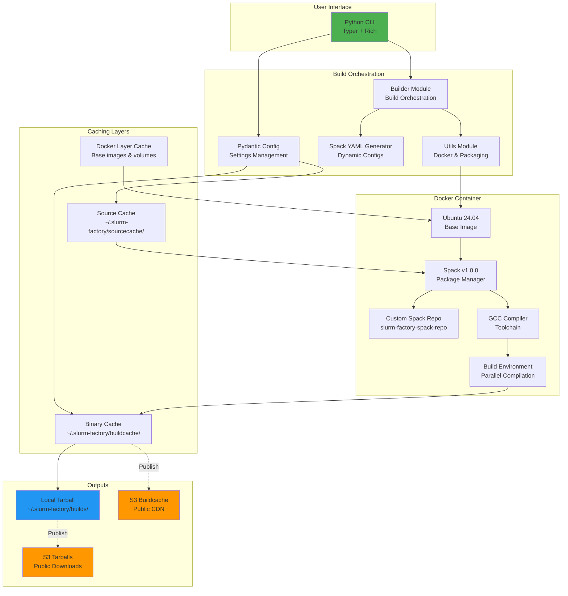
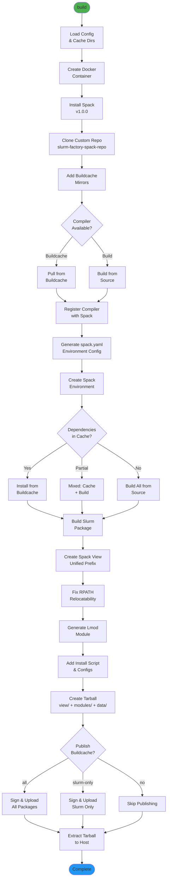
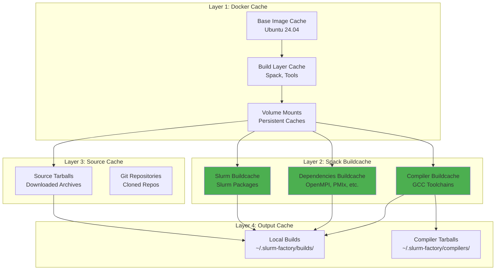
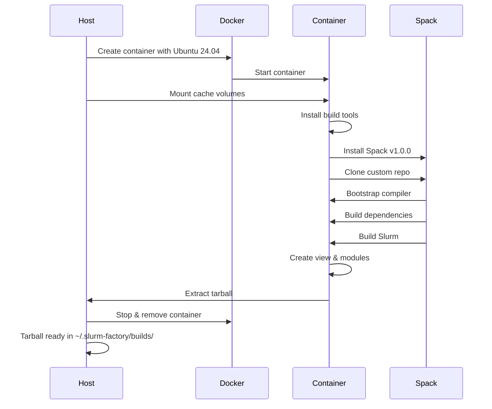
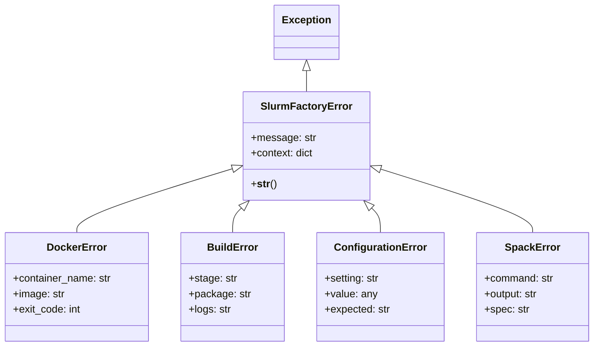

# Architecture

Slurm Factory is a modern Python-based build system that creates relocatable Slurm packages using Docker containers and Spack. The architecture is designed for modularity, reproducibility, and performance with intelligent caching at multiple layers.

## System Overview



## Module Structure

```text
slurm_factory/
├── main.py          # CLI interface
├── builder.py       # Build orchestration
├── config.py        # Settings & cache management
├── constants.py     # Build configuration & templates
├── spack_yaml.py    # Dynamic Spack config
├── utils.py         # Docker & package creation
└── exceptions.py    # Error handling
```

## Build Pipeline

The build process follows a multi-stage pipeline with intelligent caching:

### Stage 1: Compiler Build (Optional)

```mermaid
flowchart LR
    Start([build-compiler]) --> Config[Load Config<br/>Settings]
    Config --> Docker[Create Docker<br/>Container]
    Docker --> Spack[Bootstrap Spack<br/>v1.0.0]
    Spack --> CompilerSource[Download GCC<br/>Source]
    CompilerSource --> CompileSysGCC[Compile with<br/>System GCC]
    CompileSysGCC --> StageGCC[Stage 1 GCC<br/>Bootstrap]
    StageGCC --> BuildGCC[Build Final GCC<br/>Self-Hosted]
    BuildGCC --> Runtime[Extract gcc-runtime<br/>Separate Package]
    Runtime --> Binutils[Build binutils<br/>ld, as, etc.]
    Binutils --> Sign{Sign?}
    Sign -->|Yes| GPGSign[GPG Sign<br/>Packages]
    Sign -->|No| Index[Create Buildcache<br/>Index]
    GPGSign --> Index
    Index --> Publish{Publish?}
    Publish -->|Yes| S3Upload[Upload to S3<br/>Buildcache]
    Publish -->|No| LocalStore[Store Locally]
    S3Upload --> Done1([Complete])
    LocalStore --> Done2([Complete])
    
    style Start fill:#4CAF50
    style Done1 fill:#2196F3
    style Done2 fill:#2196F3
```



**Outputs**:
- Docker image: `slurm-factory:compiler-{version}`
- Buildcache: `~/.slurm-factory/buildcache/` (local) or S3 (published)
- Tarball: `~/.slurm-factory/compilers/{version}/gcc-{version}-compiler.tar.gz` (optional)

**Time**: 30-60 minutes (first build), 2-5 minutes (from cache)

### Stage 2: Slurm Build



**Outputs**:
- Docker image: `slurm-factory:{slurm_version}-gcc{compiler_version}`
- Buildcache: `~/.slurm-factory/buildcache/` (local) or S3 (published)
- Tarball: `~/.slurm-factory/builds/slurm-{version}-gcc{compiler}-software.tar.gz`

**Time**: 
- From buildcache: 5-15 minutes
- Partial cache: 20-45 minutes  
- From source: 45-90 minutes (CPU), 90-180 minutes (GPU)

## Caching Strategy

Slurm Factory implements a sophisticated multi-layer caching system:

### Cache Hierarchy



### Cache Locations

```text
~/.slurm-factory/
├── buildcache/              # Spack binary packages (Layer 2)
│   ├── build_cache/         # Compiled binaries
│   ├── _pgp/                # GPG keys for verification
│   └── *.spec.json          # Package specifications
├── sourcecache/             # Downloaded sources (Layer 3)
│   ├── gcc-*.tar.xz
│   ├── slurm-*.tar.bz2
│   └── ...
├── builds/                  # Final tarballs (Layer 4)
│   └── slurm-*-software.tar.gz
└── compilers/               # Compiler tarballs (Layer 4)
    └── {version}/
        └── gcc-*-compiler.tar.gz
```

**Docker Volume Mounts** (Layer 1):
```bash
~/.slurm-factory/buildcache  → /opt/slurm-factory-cache/buildcache
~/.slurm-factory/sourcecache → /opt/slurm-factory-cache/sourcecache
```

### Cache Performance

| Build Scenario | Time | Cache Hit |
|----------------|------|-----------|
| First compiler build | 30-60 min | 0% |
| Subsequent compiler | 2-5 min | 95% |
| First Slurm (source) | 45-90 min | 0% |
| Slurm (compiler cached) | 30-60 min | 20% |
| Slurm (full cache) | 5-15 min | 95% |
| Slurm (GPU, source) | 90-180 min | 0% |
| Slurm (GPU, cached) | 15-25 min | 85% |

### Public Buildcache

In addition to local caching, Slurm Factory can use the **public buildcache**:

**Compiler Buildcache**:
```
https://slurm-factory-spack-binary-cache.vantagecompute.ai/compilers/{version}/buildcache
```

**Slurm Buildcache**:
```
https://slurm-factory-spack-binary-cache.vantagecompute.ai/slurm/{slurm_version}/{compiler_version}/buildcache
```

Benefits:
- ✅ **10-15x faster builds** - Skip compilation entirely
- ✅ **80-90% storage savings** - No local compilation required
- ✅ **Global CDN** - Fast downloads via CloudFront
- ✅ **Reproducible** - Identical binaries across systems

See [Slurm Factory Spack Build Cache](./slurm-factory-spack-build-cache.md) for details.

## Dependency Classification

**External (Build-Only):**

- cmake, autoconf, automake, gcc, pkg-config
- Not included in final package

**Built Fresh (Runtime):**

- munge, json-c, curl, openssl, hwloc
- Architecture-optimized, security-critical

## Relocatable Modules

Dynamic module paths using environment variable fallback:

```lua
-- Dynamic prefix with fallback
local prefix = os.getenv("SLURM_INSTALL_PREFIX") or "/opt/slurm/view"
prepend_path("PATH", pathJoin(prefix, "bin"))
prepend_path("LD_LIBRARY_PATH", pathJoin(prefix, "lib"))
setenv("SLURM_ROOT", prefix)
```

**Usage:**

```bash
# Default location
module load slurm/25.11-gcc13.4.0

# Custom location
export SLURM_INSTALL_PREFIX=/shared/apps/slurm
module load slurm/25.11-gcc13.4.0
```

## Package Structure

Single tarball output containing everything needed:

```text
slurm-{version}-gcc{compiler}-software.tar.gz (2-25GB depending on options)
├── view/                                  # Slurm installation
│   ├── bin/                               # Slurm binaries (srun, sbatch, etc.)
│   ├── sbin/                              # Daemons (slurmd, slurmctld, slurmdbd)
│   ├── lib/                               # Shared libraries and plugins
│   │   ├── libslurm.so                    # Core Slurm library
│   │   └── slurm/                         # Slurm plugins
│   ├── lib64/                             # 64-bit libraries
│   ├── include/                           # Header files
│   │   └── slurm/                         # Slurm headers
│   └── share/                             # Documentation, man pages
│       ├── man/                           # Man pages
│       └── doc/                           # Documentation
├── modules/slurm/                         # Lmod modulefiles
│   └── {version}-gcc{compiler}.lua        # Modulefile for this build
└── data/slurm_assets/                     # Configuration and scripts
    ├── slurm_install.sh                   # Installation script
    ├── defaults/                          # Systemd unit files
    │   ├── slurmd.service
    │   ├── slurmctld.service
    │   └── slurmdbd.service
    ├── slurm/                             # Configuration templates
    │   ├── slurm.conf.template
    │   ├── slurmdbd.conf.template
    │   └── cgroup.conf.template
    └── mysql/                             # Database configs
        └── slurm_acct_db.sql
```

**Package naming examples:**

- `slurm-25.11-gcc13.4.0-software.tar.gz` - Slurm 25.11 with GCC 13.4.0
- `slurm-24.11-gcc10.5.0-software.tar.gz` - Slurm 24.11 with GCC 10.5.0  
- `slurm-23.11-gcc7.5.0-software.tar.gz` - Slurm 23.11 with GCC 7.5.0

## Compiler Toolchain

Builds support 8 different GCC versions for cross-distribution compatibility:

| Compiler | Compatible Distros | glibc | Bootstrap Time |
|----------|-------------------|-------|----------------|
| GCC 14.2.0 | Ubuntu 24.10+, Fedora 40+ | 2.40+ | +60 min |
| GCC 13.4.0 | Ubuntu 24.04+, Debian 13+ | 2.39 | Default |
| GCC 12.5.0 | Ubuntu 23.10+, Debian 12+ | 2.38 | +45 min |
| GCC 11.5.0 | Ubuntu 22.04+, Debian 12+ | 2.35 | +45 min |
| GCC 10.5.0 | RHEL 8+, Ubuntu 20.04+ | 2.31 | +50 min |
| GCC 9.5.0 | RHEL 8+, CentOS 8+ | 2.28 | +50 min |
| GCC 8.5.0 | RHEL 8+, CentOS 8+ | 2.28 | +55 min |
| GCC 7.5.0 | RHEL 7+, CentOS 7+ | 2.17 | +60 min |

Older compilers add build time for initial toolchain bootstrap, but use cached binaries on subsequent builds.

## Build Options

```bash
# CPU-optimized with default compiler (recommended)
slurm-factory build --slurm-version 25.11

# Specific compiler for RHEL 8 compatibility
slurm-factory build --slurm-version 25.11 --compiler-version 10.5.0

# With GPU support (CUDA/ROCm)
slurm-factory build --slurm-version 25.11 --gpu

# Combined: RHEL 8 with GPU support
slurm-factory build --slurm-version 25.11 --compiler-version 10.5.0 --gpu
```

## Docker Integration

**Volume Mounts:**

```text
Host                                    → Container
~/.slurm-factory/buildcache             → /opt/slurm-factory-cache/buildcache
~/.slurm-factory/sourcecache            → /opt/slurm-factory-cache/sourcecache
/var/run/docker.sock                    → /var/run/docker.sock (if needed)
```

**Container Lifecycle:**



**Build Environment**:
- **Base**: Ubuntu 24.04 LTS
- **Spack**: v1.0.0
- **Python**: 3.12+
- **Build Tools**: gcc, g++, gfortran, make, cmake, autotools
- **Libraries**: libc6-dev, libssl-dev, etc.

**Resource Limits**:
```bash
# Default (can be customized)
--cpus=0               # Use all available CPUs
--memory=0             # Use all available memory
--shm-size=2g          # Shared memory for compilation
```

## Error Handling

Custom exception hierarchy for comprehensive error management:



**Exception Types**:

- **`SlurmFactoryError`** - Base exception with context
- **`DockerError`** - Docker operation failures (image build, container run)
- **`BuildError`** - Build process failures (compilation, packaging)
- **`ConfigurationError`** - Invalid configuration (missing settings, wrong types)
- **`SpackError`** - Spack-specific errors (spec resolution, install failures)

**Error Context**:

All exceptions include:
- Clear error message
- Contextual information (package, version, stage)
- Suggested remediation steps
- Debug information (when verbose mode enabled)

Example:
```python
raise BuildError(
    "Failed to build package 'slurm'",
    context={
        "package": "slurm@25.11",
        "compiler": "gcc@13.4.0",
        "stage": "compilation",
        "log_file": "/tmp/slurm-build.log"
    }
)
```

## Optimization Features

- **Parallel compilation** - 4 jobs by default
- **ccache** - C/C++ object caching
- **Docker layer caching** - Faster image builds
- **Binary package cache** - Reuse compiled dependencies
- **Hardlinks** - Fast file operations

## Security

### Process Isolation

- **Docker Containers**: All builds run in isolated containers
- **User Namespaces**: Container processes run as non-root when possible
- **Resource Limits**: CPU, memory, and disk quotas enforced
- **Network Isolation**: Containers can be restricted to specific networks

### Data Protection

- **Checksum Validation**: All downloaded sources verified
- **GPG Signing**: Buildcache packages signed with GPG keys
- **Secure Defaults**: TLS/SSL enabled for all network connections
- **No Privileged Containers**: Builds don't require privileged access

### Access Control

- **User-Specific Caches**: Each user has isolated cache directories
- **File Permissions**: Proper ownership and permissions on outputs
- **AWS OIDC**: GitHub Actions use temporary credentials (no long-lived keys)
- **Secret Management**: Sensitive data stored in GitHub Secrets

### Supply Chain Security

- **Pinned Dependencies**: Exact versions specified in `spack.yaml`
- **Source Verification**: Downloaded sources verified with checksums
- **Binary Verification**: GPG signatures on buildcache packages
- **Audit Trail**: All builds logged with full provenance information

## See Also

- [Slurm Factory Spack Build Cache](./slurm-factory-spack-build-cache.md) - Public buildcache details
- [Infrastructure](./infrastructure.md) - AWS infrastructure and CDK
- [GitHub Actions](./github-actions.md) - CI/CD workflows
- [API Reference](./api-reference.md) - CLI and Python API docs
