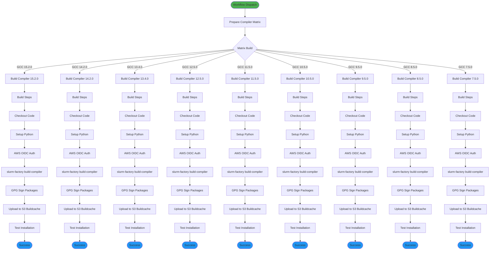
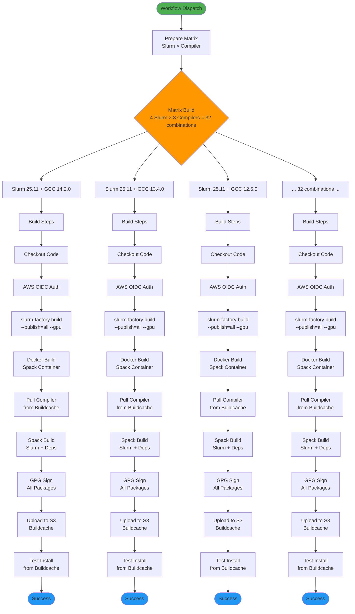
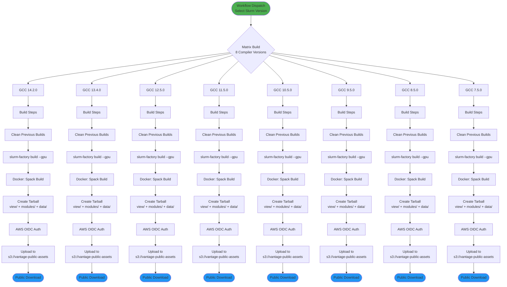
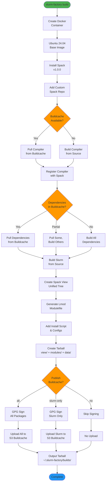

# GitHub Actions CI/CD

Slurm Factory uses GitHub Actions for continuous integration, testing, and automated builds. The workflows maintain the public buildcache, publish releases, and ensure code quality.

## Overview

The CI/CD system consists of:

- **Compiler Builds** - Build and publish GCC toolchains to buildcache
- **Slurm Builds** - Build and publish Slurm packages with all dependencies
- **Tarball Publishing** - Create relocatable tarballs and upload to S3
- **Continuous Integration** - Run tests, linters, and type checking
- **Documentation** - Auto-deploy documentation to GitHub Pages

## Workflows

### 1. Compiler Buildcache (`build-and-publish-compiler-buildcache.yml`)

**Purpose**: Build GCC compiler toolchains and publish to Spack buildcache

**Trigger**: Manual workflow dispatch

**Workflow Diagram**:



**Configuration**:
```yaml
name: Build and Publish Compiler Buildcache to S3

on:
  workflow_dispatch:
    inputs:
      compiler_versions:
        description: 'Compiler versions (comma-separated or "all")'
        required: true
        default: 'all'
        type: string

env:
  S3_BUCKET: slurm-factory-spack-buildcache-4b670
  CLOUDFRONT_URL: https://slurm-factory-spack-binary-cache.vantagecompute.ai
```

**Matrix Strategy**:
- Builds all requested compiler versions in parallel
- Each build is independent and can succeed/fail separately
- Uses self-hosted runners for performance
- 6-hour timeout per compiler build

**Key Steps**:
1. **Checkout**: Get latest code from repository
2. **Setup Python**: Install Python from `pyproject.toml` version
3. **Install uv**: Fast Python package manager
4. **Clean**: Remove previous build artifacts
5. **AWS OIDC**: Authenticate with AWS using GitHub OIDC
6. **Validate GPG**: Ensure signing keys are configured
7. **Build Compiler**: Run `slurm-factory build-compiler --publish`
8. **Sign Packages**: GPG sign all buildcache packages
9. **Upload to S3**: Sync buildcache to S3 bucket
10. **Test**: Install compiler from buildcache and verify

**Outputs**:
- Compiler buildcache at: `s3://slurm-factory-spack-buildcache-4b670/compilers/{version}/buildcache`
- Accessible via: `https://slurm-factory-spack-binary-cache.vantagecompute.ai/compilers/{version}/buildcache`

### 2. Slurm Dependencies Buildcache (`build-and-publish-slurm-all.yml`)

**Purpose**: Build Slurm packages with all dependencies for all compiler combinations

**Trigger**: Manual workflow dispatch

**Workflow Diagram**:



**Configuration**:
```yaml
name: Build and Publish Slurm Dependencies for All Compilers

on:
  workflow_dispatch:
    inputs:
      slurm_versions:
        description: 'Slurm versions (comma-separated or "all")'
        required: true
        default: 'all'
      compiler_versions:
        description: 'Compiler versions (comma-separated or "all")'
        required: true
        default: 'all'
```

**Matrix Strategy**:
- Cartesian product: Slurm versions × Compiler versions
- Default: 4 Slurm versions × 8 compilers = **32 parallel builds**
- Each combination runs independently
- 8-hour timeout per build (GPU builds can be slow)

**Build Options**:
- `--gpu`: Include CUDA/ROCm support (~180 packages)
- `--publish=all`: Publish all dependencies to buildcache
- `--no-cache`: Force fresh Docker build

**Outputs**:
- Buildcache at: `s3://slurm-factory-spack-buildcache-4b670/slurm/{slurm_version}/{compiler_version}/buildcache`
- Includes: Slurm, OpenMPI, PMIx, Munge, OpenSSL, HDF5, CUDA, and all dependencies

### 3. Slurm Tarball Publishing (`build-and-publish-slurm-tarball.yml`)

**Purpose**: Build complete Slurm tarballs and publish to public S3 bucket

**Trigger**: Manual workflow dispatch

**Workflow Diagram**:



**Configuration**:
```yaml
name: Build and Publish Slurm Tarballs to S3

on:
  workflow_dispatch:
    inputs:
      slurm_version:
        description: 'Slurm version to build'
        required: true
        default: '25.11'
      gpu_support:
        description: 'Enable GPU support'
        required: false
        default: true
        type: boolean
```

**Outputs**:
- Tarball: `slurm-{version}-gcc{compiler}-software.tar.gz`
- Location: `s3://vantage-public-assets/slurm-factory/{version}/{compiler}/`
- Public URL: `https://vantage-public-assets.s3.amazonaws.com/slurm-factory/{version}/{compiler}/slurm-{version}-gcc{compiler}-software.tar.gz`

### 4. CI Tests (`ci.yml`)

**Purpose**: Run linters, type checking, and unit tests on every pull request

**Trigger**: Pull requests to `main` branch

**Jobs**:

1. **commitlint**: Validate commit messages follow Conventional Commits
2. **ci-tests**: Run linters, type checker, and unit tests

**Steps**:
```yaml
- Checkout code
- Install just (task runner)
- Install uv (package manager)
- Run linters (ruff, codespell)
- Run type checker (pyright)
- Run unit tests (pytest)
```

**Requirements**:
- All tests must pass before PR can be merged
- Commit messages must follow `type(scope): message` format
- Code coverage threshold: 80%

### 5. Documentation Deploy (`update-docs.yml`)

**Purpose**: Build and deploy Docusaurus documentation to GitHub Pages

**Trigger**: Push to `main` branch or manual dispatch

**Steps**:
1. Checkout repository with full history
2. Setup Node.js LTS
3. Install Docusaurus dependencies
4. Build documentation
5. Deploy to GitHub Pages

**Output**: https://vantagecompute.github.io/slurm-factory

## Build Process Diagrams

### Compiler Build Process

```mermaid
flowchart LR
    Start([slurm-factory<br/>build-compiler]) --> Docker[Create Docker<br/>Container]
    Docker --> Base[Ubuntu 24.04<br/>Base Image]
    Base --> Spack[Install Spack<br/>v1.0.0]
    Spack --> Bootstrap[Bootstrap<br/>Spack]
    Bootstrap --> BuildGCC[Build GCC<br/>from Source]
    BuildGCC --> Runtime[Build gcc-runtime<br/>Package]
    Runtime --> Binutils[Build binutils]
    Binutils --> Libs[Build Libraries<br/>gmp, mpfr, mpc]
    Libs --> Sign[GPG Sign<br/>Packages]
    Sign --> Package[Create Buildcache<br/>Index]
    Package --> Upload{Publish?}
    Upload -->|Yes| S3[Upload to S3<br/>Buildcache]
    Upload -->|No| Local[Store Locally]
    S3 --> CDN[CloudFront CDN<br/>Distribution]
    Local --> Done1([Complete])
    CDN --> Done2([Complete])
    
    style Start fill:#4CAF50
    style Done1 fill:#2196F3
    style Done2 fill:#2196F3
    style Upload fill:#FF9800
```



### Slurm Build Process



## Self-Hosted Runners

The build workflows use **self-hosted runners** for:

- **Performance**: Direct access to high-performance hardware
- **Cost**: No GitHub Actions minutes consumed
- **Docker**: Pre-installed Docker for builds
- **Storage**: Large disk space for build artifacts and caches
- **Network**: Fast network for S3 uploads

**Runner Specifications**:
- **CPU**: 16+ cores
- **RAM**: 32+ GB
- **Disk**: 500+ GB SSD
- **OS**: Ubuntu 24.04 LTS
- **Docker**: 24.0+

## Secrets and Variables

### Repository Secrets

| Secret | Purpose | Used By |
|--------|---------|---------|
| `AWS_ROLE_ARN` | GitHub Actions IAM role ARN | All build workflows |
| `GPG_PRIVATE_KEY` | GPG private key for signing | Compiler & Slurm builds |
| `GPG_KEY_ID` | GPG key ID | Compiler & Slurm builds |

### Environment Variables

| Variable | Value | Purpose |
|----------|-------|---------|
| `S3_BUCKET` | `slurm-factory-spack-buildcache-4b670` | Buildcache S3 bucket |
| `CLOUDFRONT_URL` | `https://slurm-factory-spack-binary-cache.vantagecompute.ai` | Public CDN URL |

## Monitoring and Notifications

### Workflow Status

Monitor workflow runs at:
https://github.com/vantagecompute/slurm-factory/actions

### Notifications

Failed workflows generate:
- GitHub status checks on PRs
- Email notifications to repository admins
- Slack notifications (if configured)

### Build Logs

All build logs are retained for:
- **90 days** for workflow runs
- **Indefinitely** for releases

## Troubleshooting

### Workflow Failures

Check the workflow run logs for:
1. **Build errors**: Look for compilation failures
2. **Upload errors**: Check AWS credentials and permissions
3. **Test failures**: Review test output for issues

### Re-running Failed Jobs

```bash
# Re-run failed jobs only
gh workflow run build-and-publish-compiler-buildcache.yml \
  -f compiler_versions="13.4.0"

# Re-run entire workflow
gh run rerun <run-id>
```

### Debugging Locally

Test workflows locally with [act](https://github.com/nektos/act):

```bash
# Install act
brew install act  # macOS
# or
sudo snap install act  # Linux

# Run CI workflow locally
act pull_request
```

## Best Practices

### Commit Messages

Follow [Conventional Commits](https://www.conventionalcommits.org/):

```
feat: add new feature
fix: fix bug
docs: update documentation
chore: update dependencies
ci: update CI workflow
```

### Pull Requests

1. Create feature branch
2. Make changes
3. Run `just lint` and `just unit`
4. Push and create PR
5. Wait for CI to pass
6. Request review
7. Merge after approval

### Release Process

1. Update version in `pyproject.toml`
2. Update `CHANGELOG.md`
3. Create git tag: `git tag v1.0.0`
4. Push tag: `git push origin v1.0.0`
5. GitHub Actions will create release
6. Publish to PyPI: `uv build && uv publish`

## See Also

- [Infrastructure](./infrastructure.md) - AWS infrastructure details
- [Slurm Factory Spack Build Cache](./slurm-factory-spack-build-cache.md) - Using the buildcache
- [Contributing](./contributing.md) - Development guide
- [Architecture](./architecture.md) - Build system overview
