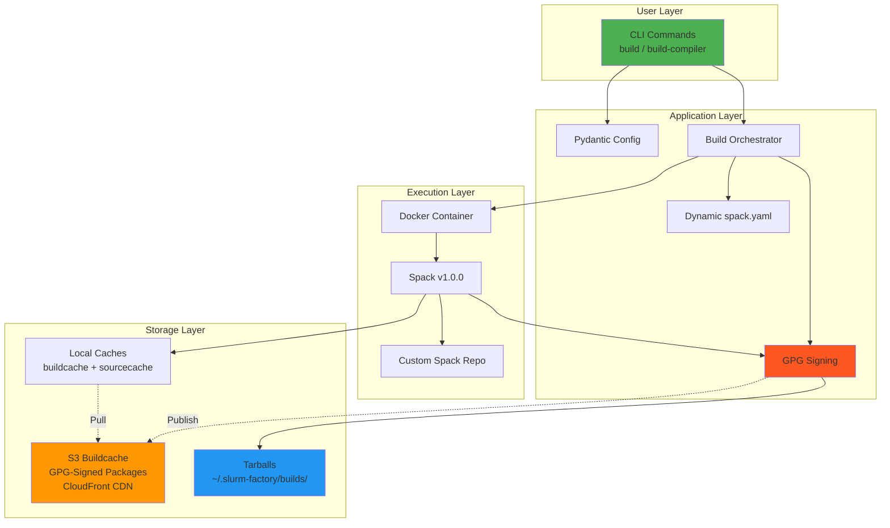

# Slurm Factory

**Slurm Factory** is a modern Python CLI tool that builds and deploys **GPG-signed, relocatable** Slurm workload manager packages for HPC environments. It leverages a **public binary cache** with cryptographically signed packages for instant, secure installations or creates custom Docker builds with Spack for specific requirements.

## Key Features

- 🔐 **GPG-Signed Packages**: All packages cryptographically signed for security and integrity
-  **Public Binary Cache**: Pre-built packages at `slurm-factory-spack-binary-cache.vantagecompute.ai`
- ⚡ **Instant Deployment**: Install from cache in 5-15 minutes instead of 45-90 minutes of compilation
- 📦 **Relocatable Packages**: Deploy to any filesystem path without recompilation
- 🔧 **Two Simple Commands**: `build` for Slurm packages, `build-compiler` for GCC toolchains
- 🏗️ **Modern Architecture**: Built with Python, Typer CLI, comprehensive test coverage
- 🎮 **GPU Support**: CUDA/ROCm-enabled builds for GPU-accelerated HPC workloads
- 🔄 **Automated CI/CD**: GitHub Actions workflows maintain the GPG-signed public buildcache
- 📊 **Module System**: Lmod modules for easy environment management
- 🌐 **Global CDN**: CloudFront distribution for fast worldwide access
- 💾 **Intelligent Caching**: Multi-layer caching (Docker, binary packages, source archives)

## Support Matrix

Slurm Factory supports Slurm builds for **multiple OS distributions**. All builds use the **system compiler** and are available as **GPG-signed** packages in the public buildcache:

### Slurm Versions

- **25.11** (Latest - recommended)
- **24.11** (LTS)
- **23.11** (Stable)

### OS Toolchains

All toolchains use the system GCC and glibc from the base OS:

- **noble** (Ubuntu 24.04 - Recommended, GCC 13.2, glibc 2.39)
- **jammy** (Ubuntu 22.04 - LTS, GCC 11.2, glibc 2.35)
- **focal** (Ubuntu 20.04 - Legacy, GCC 9.4, glibc 2.31)
- **rockylinux10** (Rocky Linux 10 / RHEL 10, GCC 14.2, glibc 2.40)
- **rockylinux9** (Rocky Linux 9 / RHEL 9, GCC 11.4, glibc 2.34)
- **rockylinux8** (Rocky Linux 8 / RHEL 8, GCC 8.5, glibc 2.28)

### Recommended Combinations

| Slurm Version | Toolchain | Build Type | Use Case |
|---------------|-----------|------------|----------|
| 25.11 | noble | CPU/GPU | **Recommended** - Latest Ubuntu LTS |
| 24.11 | jammy | CPU/GPU | Long-term support production |
| 25.11 | rockylinux10 | CPU/GPU | RHEL 10 compatible |
| 25.11 | rockylinux9 | CPU/GPU | RHEL 9 compatible |
| 23.11 | rockylinux8 | CPU | RHEL 8 compatibility |

All builds are available in the buildcache:

```text
https://slurm-factory-spack-binary-cache.vantagecompute.ai/
├── <TOOLCHAIN>/                      # OS toolchain (noble, jammy, rockylinux9, etc.)
│   └── slurm/
│       ├── deps/                     # GPG-signed Slurm dependencies
│       │   └── build_cache/
│       ├── 25.11/                    # GPG-signed Slurm 25.11 packages
│       │   └── build_cache/
│       ├── 24.11/                    # GPG-signed Slurm 24.11 packages
│       │   └── build_cache/
│       └── 23.11/                    # GPG-signed Slurm 23.11 packages
│           └── build_cache/
└── builds/                           # Pre-built tarballs with GPG signatures
    └── <SLURM_VERSION>/<TOOLCHAIN>/
        ├── slurm-<VERSION>-<TOOLCHAIN>-software.tar.gz
        └── slurm-<VERSION>-<TOOLCHAIN>-software.tar.gz.asc
```

## GPG Package Signing

All packages in the buildcache are cryptographically signed with GPG for security:

**Key Information:**

- **Key ID**: `DFB92630BCA5AB71`
- **Fingerprint**: `9C4E 8B2F 3A1D 5E6C 7F8A  9B0D DFB9 2630 BCA5 AB71`
- **Owner**: Vantage Compute Corporation (Slurm Factory Spack Cache Signing Key)
- **Email**: info@vantagecompute.ai

**Why GPG Signing?**

- **Authenticity**: Verify packages were built by Vantage Compute
- **Integrity**: Detect tampering or corruption during download
- **Security**: Prevent man-in-the-middle attacks
- **Trust Chain**: Establish provenance for production deployments
- **Compliance**: Meets security requirements for production deployments

Keys are automatically imported and trusted when using the buildcache. See [GPG Package Verification](#gpg-package-verification) below for details.

## Quick Start

Choose your installation method:

### Option 1: Install Pre-built Slurm from Buildcache (Recommended - Fastest!)

**No slurm-factory tool needed** - just Spack:

```bash
# Install Spack v1.0.0
git clone --depth 1 --branch v1.0.0 https://github.com/spack/spack.git
source spack/share/spack/setup-env.sh

# Set versions and configure two-tier mirrors (organized by toolchain)
SLURM_VERSION=25.11
TOOLCHAIN=noble  # or: jammy, resolute, rockylinux9, rockylinux10, rockylinux8
CLOUDFRONT_URL=https://slurm-factory-spack-binary-cache.vantagecompute.ai

spack mirror add slurm-factory-deps "${CLOUDFRONT_URL}/${TOOLCHAIN}/slurm/deps/"
spack mirror add slurm-factory-slurm "${CLOUDFRONT_URL}/${TOOLCHAIN}/slurm/${SLURM_VERSION}/"

# Import GPG keys and install Slurm (5-15 minutes)
spack buildcache keys --install --trust
spack install slurm@${SLURM_VERSION} target=x86_64_v3
```

**→ See the complete guide:** [Installing Slurm from Buildcache](installing-slurm-from-buildcache.md)

### Option 1b: Download Pre-built Tarball (Alternative)

Download a complete Slurm installation as a GPG-signed tarball:

```bash
# Set versions
SLURM_VERSION=25.11
TOOLCHAIN=noble  # or: jammy, resolute, rockylinux9, rockylinux10, rockylinux8
CLOUDFRONT_URL=https://slurm-factory-spack-binary-cache.vantagecompute.ai

# Download tarball and GPG signature
wget "${CLOUDFRONT_URL}/builds/${SLURM_VERSION}/${TOOLCHAIN}/slurm-${SLURM_VERSION}-${TOOLCHAIN}-software.tar.gz"
wget "${CLOUDFRONT_URL}/builds/${SLURM_VERSION}/${TOOLCHAIN}/slurm-${SLURM_VERSION}-${TOOLCHAIN}-software.tar.gz.asc"

# Import GPG key and verify signature
gpg --keyserver keyserver.ubuntu.com --recv-keys DFB92630BCA5AB71
gpg --verify slurm-${SLURM_VERSION}-${TOOLCHAIN}-software.tar.gz.asc \
             slurm-${SLURM_VERSION}-${TOOLCHAIN}-software.tar.gz

# Extract and install (only if signature is valid!)
sudo tar -xzf slurm-${SLURM_VERSION}-${TOOLCHAIN}-software.tar.gz -C /opt/
cd /opt && sudo ./data/slurm_assets/slurm_install.sh --full-init
```

**→ See GPG verification guide:** [Verifying GPG Signatures](verify-gpg-signature.md)
**→ Full workflow and Dockerfiles:** [Installing Slurm from Tarball](installing-slurm-from-tarball.md)

### Option 2: Build Custom Slurm with slurm-factory Tool

**Install the slurm-factory tool** for custom builds:

```bash
# Install Docker
curl -fsSL https://get.docker.com | sh
sudo usermod -aG docker $USER && newgrp docker

# Install slurm-factory from PyPI
pip install slurm-factory

# Build Slurm (~45 minutes)
slurm-factory build-slurm --slurm-version 25.11 --toolchain noble
```

**→ See the complete guide:** [Installing slurm-factory Tool](installation.md)

## Two Primary Commands

### `build-slurm`

Build complete Slurm packages with all dependencies:

```bash
# Standard build (CPU-optimized, ~2-5GB)
slurm-factory build-slurm --slurm-version 25.11 --toolchain noble

# GPU support (includes CUDA/ROCm, ~15-25GB)
slurm-factory build-slurm --slurm-version 25.11 --toolchain noble --gpu

# Use specific toolchain for Rocky Linux
slurm-factory build-slurm --slurm-version 25.11 --toolchain rockylinux9

# Publish to buildcache (requires AWS credentials)
slurm-factory build-slurm --slurm-version 25.11 --toolchain noble --publish=all
```

**Supported Slurm Versions**: 25.11, 24.11, 23.11

**Supported Toolchains**: resolute, noble, jammy, rockylinux10, rockylinux9, rockylinux8

**Output**: Tarball at `~/.slurm-factory/builds/slurm-{version}-{toolchain}-software.tar.gz`

## Public Buildcache

Pre-built packages are available at `slurm-factory-spack-binary-cache.vantagecompute.ai` via global CloudFront CDN.

### Available Packages

#### Slurm Dependencies

- **URL**: `https://slurm-factory-spack-binary-cache.vantagecompute.ai/{toolchain}/slurm/deps/`
- **Toolchains**: noble, jammy, resolute, rockylinux10, rockylinux9, rockylinux8
- **Includes**: All dependencies (OpenMPI, OpenSSL, Munge, PMIx, HDF5, hwloc, etc.)

#### Slurm Packages

- **URL**: `https://slurm-factory-spack-binary-cache.vantagecompute.ai/{toolchain}/slurm/{version}/`
- **Slurm Versions**: 25.11, 24.11, 23.11
- **Toolchains**: All 6 OS toolchains
- **Includes**: Slurm packages built with system compiler

### Benefits

- ⚡ **10x Faster**: Install in 5-15 minutes vs 45-90 minutes building from source
- 🔒 **Verified Builds**: All packages GPG-signed and tested via GitHub Actions CI/CD
- 🌐 **Global CDN**: CloudFront distribution for fast worldwide access
- 🔄 **Always Current**: Automated workflows keep packages up-to-date
- 💾 **Storage Efficient**: Download only what you need (2-25GB vs 50GB build requirements)

### Usage Example

#### Install Slurm 25.11 from Buildcache with noble toolchain (Ubuntu 24.04)

```bash
# Install the Slurm-Factory Spack Repo
spack repo add https://github.com/vantagecompute/slurm-factory-spack-repo ~/slurm-factory-spack-repo

# Set versions and configure mirrors
SLURM_VERSION=25.11
TOOLCHAIN=noble
CLOUDFRONT_URL=https://slurm-factory-spack-binary-cache.vantagecompute.ai

# Add two-tier mirrors (organized by toolchain)
spack mirror add slurm-factory-deps "${CLOUDFRONT_URL}/${TOOLCHAIN}/slurm/deps/"
spack mirror add slurm-factory-slurm "${CLOUDFRONT_URL}/${TOOLCHAIN}/slurm/${SLURM_VERSION}/"

spack buildcache keys --install --trust
spack install slurm@${SLURM_VERSION} target=x86_64_v3
```

#### Install Slurm 25.11 Tarball from Buildcache

```bash
# Set versions
SLURM_VERSION=25.11
TOOLCHAIN=noble
CLOUDFRONT_URL=https://slurm-factory-spack-binary-cache.vantagecompute.ai

# Download and install tarball
wget "${CLOUDFRONT_URL}/builds/${SLURM_VERSION}/${TOOLCHAIN}/slurm-${SLURM_VERSION}-${TOOLCHAIN}-software.tar.gz"
tar -xzf slurm-${SLURM_VERSION}-${TOOLCHAIN}-software.tar.gz -C /opt/
```

## GPG Package Verification

All packages in the Slurm Factory buildcache are cryptographically signed with GPG for security and integrity.

### Importing GPG Keys

```bash
# After adding a buildcache mirror, import the signing keys
spack buildcache keys --install --trust

# Verify keys are imported
spack gpg list
```

### Automatic Verification

Once keys are imported, Spack automatically verifies signatures:

```bash
# Install with signature verification (default behavior)
spack install slurm@25.11

# Spack will verify the GPG signature before installation
```

### Why This Matters

- **Security**: Ensures packages haven't been tampered with
- **Integrity**: Confirms packages are authentic from Slurm Factory
- **Trust**: Cryptographic proof of package origin
- **Compliance**: Meets security requirements for production deployments

### Manual Key Verification

For production environments, verify the key fingerprint:

```bash
# Import the public key
spack buildcache keys --install --trust

# Verify the fingerprint
gpg --list-keys --keyid-format LONG

# Should show:
# pub   rsa4096/DFB92630BCA5AB71 2025-01-XX
#       9C4E 8B2F 3A1D 5E6C 7F8A  9B0D DFB9 2630 BCA5 AB71
```

All packages are signed during the CI/CD build process and verified before deployment.

## Build Types Comparison

| Build Type | Dependencies | Size | Build Time | Buildcache Time | Use Case |
|------------|-------------|------|------------|-----------------|----------|
| **CPU-only** | ~45 packages | 2-5GB | 35-45 min | 5-10 min | Production clusters |
| **GPU-enabled** | ~180 packages | 15-25GB | 75-90 min | 15-20 min | GPU/CUDA clusters |

## Requirements

### For Using Buildcache

- Python 3.12+ (for slurm-factory tool - optional, can use Spack directly)
- Spack v1.0.0+
- 10-25GB disk space (depending on build type)
- Internet connection for buildcache download

### For Local Builds

- Python 3.12+
- Docker 24.0+
- 50GB disk space
- 4+ CPU cores, 16GB RAM recommended
- Internet connection for initial Docker image pull

## GitHub Actions CI/CD

Slurm Factory uses GitHub Actions workflows to maintain the public buildcache:

1. **build-and-publish-slurm-dependencies.yml**: Builds and publishes Slurm dependencies for all OS toolchains
2. **build-and-publish-slurm.yml**: Builds Slurm packages for all version × toolchain combinations

All workflows use:

- AWS OIDC authentication for secure S3 access
- Self-hosted runners for faster builds
- Matrix builds for parallel execution (6 toolchains × 3 Slurm versions = 18 combinations)
- GPG signing for package integrity
- Automated testing of buildcache installations

See [GitHub Actions](./github-actions.md) for detailed workflow documentation.

## Use Cases

- **HPC Cluster Deployment**: Standardized Slurm installations across heterogeneous clusters
- **Development Environments**: Quick Slurm setup for testing without lengthy compilation
- **Multi-Version Support**: Running different Slurm versions side-by-side with module system
- **Performance Testing**: Optimized builds for specific hardware configurations  
- **Container Deployment**: Portable packages for containerized HPC environments
- **Air-Gapped Installations**: Download buildcache once, deploy offline
- **Research Computing Centers**: Standardize Slurm deployments across multiple clusters
- **Cloud HPC Providers**: Rapidly provision clusters with consistent, tested software stacks
- **Educational Institutions**: Provide reproducible HPC environments for teaching and research
- **Industry HPC**: Deploy compliance-ready solutions with full audit trails and security
- **CI/CD Pipelines**: Automated testing and validation of HPC software stacks

## Architecture

Slurm Factory uses a modern, modular architecture:



**Key Components:**

- **Typer CLI**: Auto-completion, rich help text, type-safe command validation
- **Pydantic Configuration**: Type-safe settings with environment variable support
- **Docker Isolation**: Reproducible builds with version-controlled dependencies
- **Dynamic spack.yaml**: Programmatically generated Spack environment specs
- **GPG Signing**: Automatic cryptographic signing of all packages
- **Multi-Layer Caching**: Docker layers, binary packages, source archives, compiler cache

## Infrastructure

Slurm Factory is supported by comprehensive AWS infrastructure:

**Components:**

- **S3 Buildcache Bucket**: `slurm-factory-spack-buildcache-4b670`
- **CloudFront Distribution**: Global CDN for fast buildcache access
- **Route53 DNS**: `slurm-factory-spack-binary-cache.vantagecompute.ai`
- **GitHub OIDC**: Secure, keyless authentication for CI/CD
- **AWS CDK**: Infrastructure as code for reproducible deployments

**Buildcache Organization:**

The buildcache uses a toolchain-first structure for optimal cache reuse:

```
{CLOUDFRONT_URL}/
├── noble/slurm/deps/       # Shared dependencies for Ubuntu 24.04
├── noble/slurm/25.11/      # Slurm 25.11 for Ubuntu 24.04
├── noble/slurm/24.11/      # Slurm 24.11 for Ubuntu 24.04
├── jammy/slurm/...         # Ubuntu 22.04 builds
├── rockylinux9/slurm/...   # Rocky Linux 9 builds
└── ...                     # Other toolchains
```

See [Infrastructure](./infrastructure.md) and [GitHub Actions](./github-actions.md) for details.

## Next Steps

- **[Installing Slurm from Buildcache](./installing-slurm-from-buildcache.md)**: Fast installation using pre-built packages
- **[Installing slurm-factory Tool](./installation.md)**: Setup for building custom packages
- **[API Reference](./api-reference.md)**: Complete documentation of `build` and `build-compiler` commands
- **[Build Artifacts](./build-artifacts.md)**: Understanding the buildcache and tarball outputs
- **[Architecture](./architecture.md)**: Deep dive into the build system internals
- **[Examples](./examples.md)**: Real-world usage scenarios
- **[Deployment](./deployment.md)**: Installing and configuring built packages
- **[Contributing](./contributing.md)**: Development workflow and submitting changes
- **[Infrastructure](./infrastructure.md)**: AWS infrastructure and CDK deployment
- **[GitHub Actions](./github-actions.md)**: CI/CD workflows and automation

---

**Built with ❤️ by [Vantage Compute](https://vantagecompute.ai)**
