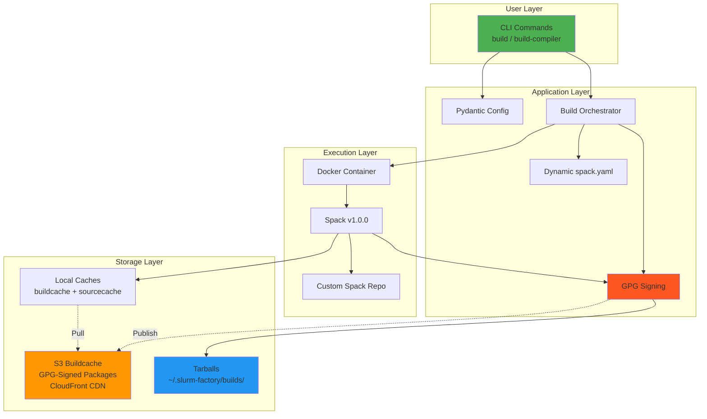

# Slurm Factory

**Slurm Factory** is a modern Python CLI tool that builds and deploys **GPG-signed, relocatable** Slurm workload manager packages for HPC environments. It leverages a **public binary cache** with cryptographically signed packages for instant, secure installations or creates custom Docker builds with Spack for specific requirements.

## Key Features

- 🔐 **GPG-Signed Packages**: All packages cryptographically signed for security and integrity
-  **Public Binary Cache**: Pre-built packages at `slurm-factory-spack-binary-cache.vantagecompute.ai`
- ⚡ **Instant Deployment**: Install from cache in 5-15 minutes instead of 45-90 minutes of compilation
- 📦 **Relocatable Packages**: Deploy to any filesystem path without recompilation
- 🔧 **Two Simple Commands**: `build` for Slurm packages, `build-compiler` for GCC toolchains
- 🏗️ **Modern Architecture**: Built with Python, Typer CLI, comprehensive test coverage
- 🎮 **GPU Support**: CUDA/ROCm-enabled builds for GPU-accelerated HPC workloads
- 🔄 **Automated CI/CD**: GitHub Actions workflows maintain the GPG-signed public buildcache
- 📊 **Module System**: Lmod modules for easy environment management
- 🌐 **Global CDN**: CloudFront distribution for fast worldwide access
- 💾 **Intelligent Caching**: Multi-layer caching (Docker, binary packages, source archives)

## Support Matrix

Slurm Factory supports **27 combinations** of Slurm and GCC compiler versions. All combinations are pre-built, **GPG-signed**, and available in the public buildcache:

### Slurm Versions

- **25.11** (Latest - recommended)
- **24.11** (LTS)
- **23.11** (Stable)

### GCC Compiler Versions

All GCC toolchains are GPG-signed and include matching glibc for cross-distro compatibility:

- **15.2.0** (Latest GCC 15, glibc 2.40)
- **14.2.0** (Latest GCC 14, glibc 2.39)
- **13.4.0** (Recommended default, glibc 2.39, Ubuntu 24.04)
- **12.5.0** (glibc 2.35)
- **11.5.0** (glibc 2.35, Ubuntu 22.04)
- **10.5.0** (glibc 2.31, RHEL 8/Ubuntu 20.04)
- **9.5.0** (glibc 2.28)
- **8.5.0** (glibc 2.28, RHEL 8)
- **7.5.0** (glibc 2.17, RHEL 7 - maximum compatibility)

### Recommended Combinations

| Slurm Version | GCC Version | Build Type | Use Case |
|---------------|-------------|------------|----------|
| 25.11 | 13.4.0 | CPU/GPU | **Recommended** - Latest features, best compatibility |
| 24.11 | 13.4.0 | CPU/GPU | Long-term support production |
| 25.11 | 15.2.0 | CPU/GPU | Bleeding edge, latest compiler features |
| 23.11 | 11.5.0 | CPU | Conservative production environments |
| 25.11 | 10.5.0 | CPU | RHEL 8 / Ubuntu 20.04 compatibility |
| 24.11 | 7.5.0 | CPU | RHEL 7 / maximum backward compatibility |

All 27 version combinations are GPG-signed and available in the buildcache with a three-tier mirror architecture:

```text
https://slurm-factory-spack-binary-cache.vantagecompute.ai/
├── compilers/<GCC_VERSION>/         # GPG-signed compiler toolchains
├── deps/<GCC_VERSION>/              # GPG-signed Slurm dependencies
├── slurm/<SLURM_VERSION>/<GCC_VERSION>/  # GPG-signed Slurm packages
└── builds/<SLURM_VERSION>/<GCC_VERSION>/ # Pre-built tarballs with signatures
    ├── slurm-<VERSION>-gcc<VERSION>-software.tar.gz
    └── slurm-<VERSION>-gcc<VERSION>-software.tar.gz.asc  # GPG signature
```

## GPG Package Signing

All packages in the buildcache are cryptographically signed with GPG for security:

**Key Information:**

- **Key ID**: `DFB92630BCA5AB71`
- **Fingerprint**: `9C4E 8B2F 3A1D 5E6C 7F8A  9B0D DFB9 2630 BCA5 AB71`
- **Owner**: Vantage Compute Corporation (Slurm Factory Spack Cache Signing Key)
- **Email**: info@vantagecompute.ai

**Why GPG Signing?**

- **Authenticity**: Verify packages were built by Vantage Compute
- **Integrity**: Detect tampering or corruption during download
- **Security**: Prevent man-in-the-middle attacks
- **Trust Chain**: Establish provenance for production deployments
- **Compliance**: Meets security requirements for production deployments

Keys are automatically imported and trusted when using the buildcache. See [GPG Package Verification](#gpg-package-verification) below for details.

## Quick Start

Choose your installation method:

### Option 1: Install Pre-built Slurm from Buildcache (Recommended - Fastest!)

**No slurm-factory tool needed** - just Spack:

```bash
# Install Spack v1.0.0
git clone --depth 1 --branch v1.0.0 https://github.com/spack/spack.git
source spack/share/spack/setup-env.sh

# Set versions and configure three-tier mirrors
SLURM_VERSION=25.11
COMPILER_VERSION=15.2.0
CLOUDFRONT_URL=https://slurm-factory-spack-binary-cache.vantagecompute.ai

spack mirror add slurm-factory-build-toolchain "${CLOUDFRONT_URL}/compilers/${COMPILER_VERSION}"
spack mirror add slurm-factory-slurm-deps "${CLOUDFRONT_URL}/deps/${COMPILER_VERSION}"
spack mirror add slurm-factory-slurm "${CLOUDFRONT_URL}/slurm/${SLURM_VERSION}/${COMPILER_VERSION}"

# Import GPG keys and install Slurm (5-15 minutes)
spack buildcache keys --install --trust
spack install slurm@${SLURM_VERSION}%gcc@${COMPILER_VERSION} target=x86_64_v3
```

**→ See the complete guide:** [Installing Slurm from Buildcache](installing-slurm-from-buildcache.md)

### Option 1b: Download Pre-built Tarball (Alternative)

Download a complete Slurm installation as a GPG-signed tarball:

```bash
# Set versions
SLURM_VERSION=25.11
COMPILER_VERSION=15.2.0
CLOUDFRONT_URL=https://slurm-factory-spack-binary-cache.vantagecompute.ai

# Download tarball and GPG signature
wget "${CLOUDFRONT_URL}/builds/${SLURM_VERSION}/${COMPILER_VERSION}/slurm-${SLURM_VERSION}-gcc${COMPILER_VERSION}-software.tar.gz"
wget "${CLOUDFRONT_URL}/builds/${SLURM_VERSION}/${COMPILER_VERSION}/slurm-${SLURM_VERSION}-gcc${COMPILER_VERSION}-software.tar.gz.asc"

# Import GPG key and verify signature
gpg --keyserver keyserver.ubuntu.com --recv-keys DFB92630BCA5AB71
gpg --verify slurm-${SLURM_VERSION}-gcc${COMPILER_VERSION}-software.tar.gz.asc \
             slurm-${SLURM_VERSION}-gcc${COMPILER_VERSION}-software.tar.gz

# Extract and install (only if signature is valid!)
sudo tar -xzf slurm-${SLURM_VERSION}-gcc${COMPILER_VERSION}-software.tar.gz -C /opt/
cd /opt && sudo ./data/slurm_assets/slurm_install.sh --full-init
```

**→ See GPG verification guide:** [Verifying GPG Signatures](../VERIFY_GPG_SIGNATURE.md)

### Option 2: Build Custom Slurm with slurm-factory Tool

**Install the slurm-factory tool** for custom builds:

```bash
# Install Docker
curl -fsSL https://get.docker.com | sh
sudo usermod -aG docker $USER && newgrp docker

# Install slurm-factory from PyPI
pip install slurm-factory

# Build Slurm (~45 minutes)
slurm-factory build --slurm-version 25.11 --compiler-version 13.4.0
```

**→ See the complete guide:** [Installing slurm-factory Tool](installation.md)

## Two Primary Commands

### `build-compiler`

Build GCC compiler toolchains for use with Slurm builds:

```bash
# Build GCC 13.4.0 (default recommended version)
slurm-factory build-compiler

# Build specific version
slurm-factory build-compiler --compiler-version 14.2.0

# Build and publish to buildcache (requires AWS credentials)
slurm-factory build-compiler --compiler-version 13.4.0 --publish
```

**Supported Versions**: 15.2.0, 14.2.0, 13.4.0, 12.5.0, 11.5.0, 10.5.0, 9.5.0, 8.5.0, 7.5.0

**Output**: Docker image and optional buildcache upload to S3

### `build`

Build complete Slurm packages with all dependencies:

```bash
# Standard build (CPU-optimized, ~2-5GB)
slurm-factory build --slurm-version 25.11

# GPU support (includes CUDA/ROCm, ~15-25GB)
slurm-factory build --slurm-version 25.11 --gpu

# Use specific compiler version
slurm-factory build --slurm-version 25.11 --compiler-version 14.2.0

# Publish to buildcache (requires AWS credentials)
slurm-factory build --slurm-version 25.11 --publish=all
```

**Supported Versions**: 25.11, 24.11, 23.11

**Output**: Tarball at `~/.slurm-factory/builds/slurm-{version}-gcc{compiler}-software.tar.gz`

## Public Buildcache

Pre-built packages are available at `slurm-factory-spack-binary-cache.vantagecompute.ai` via global CloudFront CDN.

### Available Packages

#### Compilers

- **URL**: `https://slurm-factory-spack-binary-cache.vantagecompute.ai/compilers/{version}/buildcache`
- **Versions**: GCC 7.5.0 through 15.2.0
- **Includes**: gcc, gcc-runtime, binutils, gmp, mpfr, mpc, zlib-ng, zstd

#### Slurm Packages

- **URL**: `https://slurm-factory-spack-binary-cache.vantagecompute.ai/slurm/{slurm_version}/{compiler_version}/buildcache`
- **Slurm Versions**: 25.11, 24.11, 23.11
- **Compiler Combinations**: Each Slurm version × each GCC version
- **Includes**: All dependencies (OpenMPI, OpenSSL, Munge, PMIx, HDF5, etc.)

### Benefits

- ⚡ **10x Faster**: Install in 5-15 minutes vs 45-90 minutes building from source
- 🔒 **Verified Builds**: All packages GPG-signed and tested via GitHub Actions CI/CD
- 🌐 **Global CDN**: CloudFront distribution for fast worldwide access
- 🔄 **Always Current**: Automated workflows keep packages up-to-date
- 💾 **Storage Efficient**: Download only what you need (2-25GB vs 50GB build requirements)

### Usage Examples

```bash
# Install latest Slurm with recommended compiler
spack mirror add slurm-factory \
  https://slurm-factory-spack-binary-cache.vantagecompute.ai/slurm/25.11/13.4.0/buildcache
spack buildcache keys --install --trust
spack install slurm@25.11

# Install legacy Slurm with older compiler
spack mirror add slurm-factory \
  https://slurm-factory-spack-binary-cache.vantagecompute.ai/slurm/23.11/11.5.0/buildcache
spack buildcache keys --install --trust
spack install slurm@23.11

# Install just the compiler
spack mirror add gcc-buildcache \
  https://slurm-factory-spack-binary-cache.vantagecompute.ai/compilers/13.4.0/buildcache
spack buildcache keys --install --trust
spack install gcc@13.4.0
```

## GPG Package Verification

All packages in the Slurm Factory buildcache are cryptographically signed with GPG for security and integrity.

### Importing GPG Keys

```bash
# After adding a buildcache mirror, import the signing keys
spack buildcache keys --install --trust

# Verify keys are imported
spack gpg list
```

### Automatic Verification

Once keys are imported, Spack automatically verifies signatures:

```bash
# Install with signature verification (default behavior)
spack install slurm@25.11

# Spack will verify the GPG signature before installation
```

### Why This Matters

- **Security**: Ensures packages haven't been tampered with
- **Integrity**: Confirms packages are authentic from Slurm Factory
- **Trust**: Cryptographic proof of package origin
- **Compliance**: Meets security requirements for production deployments

### Manual Key Verification

For production environments, verify the key fingerprint:

```bash
# Import the public key
spack buildcache keys --install --trust

# Verify the fingerprint
gpg --list-keys --keyid-format LONG

# Should show:
# pub   rsa4096/DFB92630BCA5AB71 2025-01-XX
#       9C4E 8B2F 3A1D 5E6C 7F8A  9B0D DFB9 2630 BCA5 AB71
```

All packages are signed during the CI/CD build process and verified before deployment.

## Build Types Comparison

| Build Type | Dependencies | Size | Build Time | Buildcache Time | Use Case |
|------------|-------------|------|------------|-----------------|----------|
| **CPU-only** | ~45 packages | 2-5GB | 35-45 min | 5-10 min | Production clusters |
| **GPU-enabled** | ~180 packages | 15-25GB | 75-90 min | 15-20 min | GPU/CUDA clusters |

## Requirements

### For Using Buildcache

- Python 3.12+ (for slurm-factory tool - optional, can use Spack directly)
- Spack v1.0.0+
- 10-25GB disk space (depending on build type)
- Internet connection for buildcache download

### For Local Builds

- Python 3.12+
- Docker 24.0+
- 50GB disk space
- 4+ CPU cores, 16GB RAM recommended
- Internet connection for initial Docker image pull

## GitHub Actions CI/CD

Slurm Factory uses three GitHub Actions workflows to maintain the public buildcache:

1. **build-and-publish-compiler-buildcache.yml**: Builds and publishes GCC compiler toolchains
2. **build-and-publish-slurm-deps-all-compilers.yml**: Builds Slurm dependencies for all compiler combinations
3. **build-and-publish-all-packages.yml**: Builds complete Slurm packages (Slurm + dependencies)

All workflows use:

- AWS OIDC authentication for secure S3 access
- Self-hosted runners for faster builds
- Matrix builds for parallel execution
- Automated testing of buildcache installations

See [Contributing Guide](./contributing.md) for details on setting up CI/CD workflows.

## Use Cases

- **HPC Cluster Deployment**: Standardized Slurm installations across heterogeneous clusters
- **Development Environments**: Quick Slurm setup for testing without lengthy compilation
- **Multi-Version Support**: Running different Slurm versions side-by-side with module system
- **Performance Testing**: Optimized builds for specific hardware configurations  
- **Container Deployment**: Portable packages for containerized HPC environments
- **Air-Gapped Installations**: Download buildcache once, deploy offline
- **Research Computing Centers**: Standardize Slurm deployments across multiple clusters
- **Cloud HPC Providers**: Rapidly provision clusters with consistent, tested software stacks
- **Educational Institutions**: Provide reproducible HPC environments for teaching and research
- **Industry HPC**: Deploy compliance-ready solutions with full audit trails and security
- **CI/CD Pipelines**: Automated testing and validation of HPC software stacks

## Architecture

Slurm Factory uses a modern, modular architecture:



**Key Components:**

- **Typer CLI**: Auto-completion, rich help text, type-safe command validation
- **Pydantic Configuration**: Type-safe settings with environment variable support
- **Docker Isolation**: Reproducible builds with version-controlled dependencies
- **Dynamic spack.yaml**: Programmatically generated Spack environment specs
- **GPG Signing**: Automatic cryptographic signing of all packages
- **Multi-Layer Caching**: Docker layers, binary packages, source archives, compiler cache

## Infrastructure

Slurm Factory is supported by comprehensive AWS infrastructure:

**Components:**

- **S3 Buildcache Bucket**: `slurm-factory-spack-buildcache-4b670`
- **CloudFront Distribution**: Global CDN for fast buildcache access
- **Route53 DNS**: `slurm-factory-spack-binary-cache.vantagecompute.ai`
- **GitHub OIDC**: Secure, keyless authentication for CI/CD
- **AWS CDK**: Infrastructure as code for reproducible deployments

**CI/CD Workflows:**

Three GitHub Actions workflows maintain the buildcache:

1. **Compiler Buildcache**: Build and publish GCC toolchains
2. **Slurm Dependencies**: Build Slurm packages for all compiler combinations  
3. **Tarball Publishing**: Create and publish relocatable tarballs

All workflows run on self-hosted runners with GPG signing and automated testing.

See [Infrastructure](./infrastructure.md) and [GitHub Actions](./github-actions.md) for details.

## Next Steps

- **[Installing Slurm from Buildcache](./installing-slurm-from-buildcache.md)**: Fast installation using pre-built packages
- **[Installing slurm-factory Tool](./installation.md)**: Setup for building custom packages
- **[API Reference](./api-reference.md)**: Complete documentation of `build` and `build-compiler` commands
- **[Build Artifacts](./build-artifacts.md)**: Understanding the buildcache and tarball outputs
- **[Architecture](./architecture.md)**: Deep dive into the build system internals
- **[Examples](./examples.md)**: Real-world usage scenarios
- **[Deployment](./deployment.md)**: Installing and configuring built packages
- **[Contributing](./contributing.md)**: Development workflow and submitting changes
- **[Infrastructure](./infrastructure.md)**: AWS infrastructure and CDK deployment
- **[GitHub Actions](./github-actions.md)**: CI/CD workflows and automation

---

**Built with ❤️ by [Vantage Compute](https://vantagecompute.ai)**
