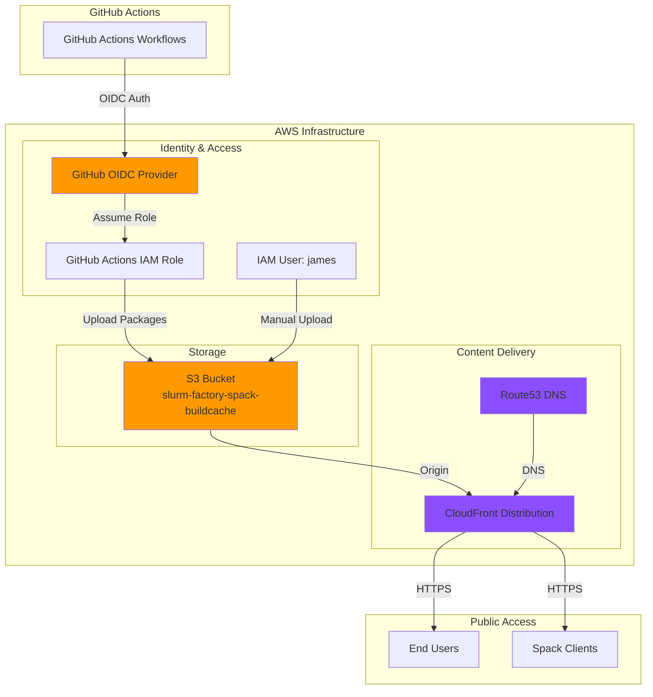

# Infrastructure

The Slurm Factory infrastructure is fully automated and managed as code using AWS CDK (Cloud Development Kit). This document describes the AWS infrastructure components that power the public build cache and deployment system.

## Overview

The infrastructure provides:

- **Public Binary Cache** - S3 bucket with Spack buildcache packages
- **Global CDN** - CloudFront distribution for fast worldwide access
- **Secure Publishing** - GitHub Actions OIDC integration for automated uploads
- **DNS Management** - Route53 custom domain configuration
- **Infrastructure as Code** - Fully reproducible AWS CDK deployment

## Architecture Diagram



## Components

### S3 Bucket

**Name**: `slurm-factory-spack-buildcache-4b670`

**Purpose**: Storage for Spack binary cache packages (compilers, Slurm packages, dependencies)

**Configuration**:
- **Region**: us-east-1
- **Encryption**: S3-managed (AES-256)
- **Versioning**: Enabled
- **Lifecycle**: Delete old versions after 90 days
- **Public Access**: Blocked (access only via CloudFront)
- **Retention**: Bucket retained on stack deletion

**Access Control**:
- CloudFront Origin Access Identity (OAI) - Read-only for public distribution
- IAM User `james` - Full read/write access
- GitHub Actions Role - Read/write via OIDC

**Directory Structure**:
```
s3://slurm-factory-spack-buildcache-4b670/
├── compilers/
│   ├── 7.5.0/buildcache/
│   ├── 8.5.0/buildcache/
│   ├── 9.5.0/buildcache/
│   ├── 10.5.0/buildcache/
│   ├── 11.5.0/buildcache/
│   ├── 12.5.0/buildcache/
│   ├── 13.4.0/buildcache/
│   ├── 14.2.0/buildcache/
│   └── 15.2.0/buildcache/
└── slurm/
    ├── 25.11/{compiler}/buildcache/
    ├── 24.11/{compiler}/buildcache/
    └── 23.11/{compiler}/buildcache/
```

### CloudFront Distribution

**Domain**: `slurm-factory-spack-binary-cache.vantagecompute.ai`

**Purpose**: Global CDN for fast, reliable access to build artifacts

**Configuration**:
- **Origin**: S3 bucket via Origin Access Identity
- **HTTPS**: Redirect HTTP to HTTPS
- **TLS**: TLSv1.2_2021 minimum
- **Caching**: Optimized cache policy
- **Compression**: Enabled (gzip, brotli)
- **Price Class**: PriceClass_100 (US, Canada, Europe, Asia)
- **Geo Restriction**: None (globally accessible)

**Cache Behavior**:
- **Default TTL**: 86400 seconds (24 hours)
- **Max TTL**: 31536000 seconds (365 days)
- **Allowed Methods**: GET, HEAD, OPTIONS
- **Cached Methods**: GET, HEAD
- **Query Strings**: Forwarded

**Performance**:
- **Edge Locations**: 400+ worldwide
- **Latency**: < 50ms (most locations)
- **Bandwidth**: Unlimited
- **Availability**: 99.9% SLA

### GitHub OIDC Integration

**Purpose**: Secure, keyless authentication for GitHub Actions workflows

**Configuration**:
- **Provider**: `token.actions.githubusercontent.com`
- **Audience**: `sts.amazonaws.com`
- **Organization**: `vantagecompute`
- **Repository**: `slurm-factory`
- **Session Duration**: 10800 seconds (3 hours)

**IAM Role**: `slurm-factory-github-actions`

**Permissions**:
```json
{
  "Version": "2012-10-17",
  "Statement": [
    {
      "Effect": "Allow",
      "Action": [
        "s3:PutObject",
        "s3:GetObject",
        "s3:ListBucket",
        "s3:DeleteObject"
      ],
      "Resource": [
        "arn:aws:s3:::slurm-factory-spack-buildcache-4b670",
        "arn:aws:s3:::slurm-factory-spack-buildcache-4b670/*"
      ]
    }
  ]
}
```

**Trust Policy**:
```json
{
  "Version": "2012-10-17",
  "Statement": [
    {
      "Effect": "Allow",
      "Principal": {
        "Federated": "arn:aws:iam::ACCOUNT_ID:oidc-provider/token.actions.githubusercontent.com"
      },
      "Action": "sts:AssumeRoleWithWebIdentity",
      "Condition": {
        "StringEquals": {
          "token.actions.githubusercontent.com:aud": "sts.amazonaws.com"
        },
        "StringLike": {
          "token.actions.githubusercontent.com:sub": "repo:vantagecompute/slurm-factory:*"
        }
      }
    }
  ]
}
```

### Route53 DNS

**Domain**: `slurm-factory-spack-binary-cache.vantagecompute.ai`

**Purpose**: Custom domain for CloudFront distribution

**Configuration**:
- **Record Type**: A (Alias)
- **Alias Target**: CloudFront distribution
- **Hosted Zone**: `vantagecompute.ai`
- **TTL**: 300 seconds

**Certificate**:
- **Provider**: AWS Certificate Manager (ACM)
- **Region**: us-east-1 (required for CloudFront)
- **Validation**: DNS (automatic)
- **Auto-renewal**: Enabled

### IAM User (james)

**Purpose**: Manual uploads and administrative access

**Permissions**:
- Full S3 access to `slurm-factory-spack-buildcache-4b670`
- Read/write to all objects and prefixes
- List bucket contents

**Use Cases**:
- Manual package uploads
- Emergency fixes
- Testing new builds
- Backup access if OIDC fails

## Infrastructure as Code

The infrastructure is defined in AWS CDK (TypeScript/Python) and managed via a custom CLI.

### CDK Stack Location

```
infrastructure/
├── app.py                    # CDK app entry point
├── cdk.json                  # CDK configuration
├── pyproject.toml            # Python dependencies
└── infrastructure/
    ├── cli.py                # Typer CLI commands
    └── stacks.py             # CDK stack definitions
```

### CLI Commands

Install the infrastructure CLI:

```bash
cd infrastructure
pip install -e .
```

Available commands:

```bash
# Bootstrap CDK (first time only)
infra bootstrap --region us-east-1

# Deploy infrastructure
infra deploy

# Deploy with custom domain
infra deploy \
  --domain slurm-factory-spack-binary-cache.vantagecompute.ai \
  --hosted-zone-id Z1234567890ABC

# View stack outputs
infra outputs

# Show differences before deploying
infra diff

# Generate CloudFormation template
infra synth

# Destroy infrastructure
infra destroy --force
```

### Stack Outputs

After deployment, the stack outputs include:

```yaml
BucketName: slurm-factory-spack-buildcache-4b670
BucketArn: arn:aws:s3:::slurm-factory-spack-buildcache-4b670
DistributionId: E1234567890ABC
DistributionDomainName: d111111abcdef8.cloudfront.net
PublicUrl: https://slurm-factory-spack-binary-cache.vantagecompute.ai
GitHubActionsRoleArn: arn:aws:iam::123456789012:role/slurm-factory-github-actions
```

## Deployment

### Prerequisites

1. **AWS Account** with administrator access
2. **AWS CLI** configured with credentials
3. **CDK CLI** installed globally: `npm install -g aws-cdk`
4. **Python 3.12+** for the infrastructure CLI

### Initial Setup

```bash
# 1. Configure AWS credentials
aws configure

# 2. Install CDK globally
npm install -g aws-cdk

# 3. Install infrastructure dependencies
cd infrastructure
pip install -e .

# 4. Bootstrap CDK in your account (one-time)
infra bootstrap --region us-east-1

# 5. Deploy the stack
infra deploy
```

### Updates

To update the infrastructure:

```bash
# 1. Pull latest changes
git pull

# 2. Review changes
infra diff

# 3. Deploy updates
infra deploy
```

### Rollback

If a deployment fails:

```bash
# 1. Check CloudFormation events
aws cloudformation describe-stack-events \
  --stack-name SlurmFactoryInfraStack \
  --max-items 20

# 2. Rollback to previous version
aws cloudformation cancel-update-stack \
  --stack-name SlurmFactoryInfraStack
```

## Security

### Data Protection

- **Encryption at Rest**: S3-managed encryption (AES-256)
- **Encryption in Transit**: TLS 1.2+ required
- **Public Access Blocking**: S3 bucket blocks public access
- **Access Logging**: CloudFront access logs enabled
- **Versioning**: S3 versioning enabled for recovery

### Access Control

- **Principle of Least Privilege**: IAM roles have minimal required permissions
- **OIDC Authentication**: No long-lived credentials for GitHub Actions
- **Session Duration Limits**: 3-hour maximum for OIDC sessions
- **Resource-Based Policies**: S3 bucket policy restricts access to specific principals

### Compliance

- **HIPAA Eligible**: AWS services used are HIPAA eligible
- **SOC 2**: Infrastructure follows SOC 2 best practices
- **Audit Trail**: CloudTrail logs all API calls
- **Data Residency**: Primary region is us-east-1

## Monitoring

### CloudWatch Metrics

The infrastructure automatically sends metrics to CloudWatch:

**S3 Metrics**:
- `NumberOfObjects` - Total objects in bucket
- `BucketSizeBytes` - Total bucket size
- `AllRequests` - Total S3 requests
- `4xxErrors` - Client errors
- `5xxErrors` - Server errors

**CloudFront Metrics**:
- `Requests` - Total requests
- `BytesDownloaded` - Total bytes transferred
- `4xxErrorRate` - Client error rate
- `5xxErrorRate` - Server error rate
- `CacheHitRate` - Percentage of requests served from cache

### Alarms

Recommended CloudWatch alarms:

```bash
# High error rate alert
aws cloudwatch put-metric-alarm \
  --alarm-name slurm-factory-high-error-rate \
  --metric-name 5xxErrorRate \
  --namespace AWS/CloudFront \
  --statistic Average \
  --period 300 \
  --evaluation-periods 2 \
  --threshold 5 \
  --comparison-operator GreaterThanThreshold

# Low cache hit rate alert
aws cloudwatch put-metric-alarm \
  --alarm-name slurm-factory-low-cache-hit \
  --metric-name CacheHitRate \
  --namespace AWS/CloudFront \
  --statistic Average \
  --period 3600 \
  --evaluation-periods 1 \
  --threshold 80 \
  --comparison-operator LessThanThreshold
```

## Cost Optimization

### Current Costs (Estimated - as of January 2025)

> **Note**: These are approximate estimates based on typical usage patterns. For current pricing, consult the [AWS Pricing Calculator](https://calculator.aws/) and your actual usage metrics.

| Service | Monthly Cost | Notes |
|---------|-------------|-------|
| S3 Storage | $10-50 | ~500 GB at $0.023/GB |
| CloudFront | $5-20 | First 1 TB free, then $0.085/GB |
| Data Transfer | $0-10 | First 100 GB free |
| Route53 | $0.50 | Hosted zone |
| **Total** | **$15-80** | Varies with usage |

### Cost Reduction Strategies

1. **Lifecycle Policies**: Auto-delete old package versions after 90 days
2. **Compression**: Enable gzip/brotli to reduce transfer sizes
3. **Cache Optimization**: High TTLs reduce origin requests
4. **Price Class**: Use PriceClass_100 (cheaper edge locations)
5. **Reserved Capacity**: Consider S3 Intelligent-Tiering for large datasets

## Troubleshooting

### CloudFront Distribution Not Accessible

```bash
# 1. Check distribution status
aws cloudfront get-distribution --id E1234567890ABC

# 2. Verify DNS resolution
dig slurm-factory-spack-binary-cache.vantagecompute.ai

# 3. Test direct S3 access
aws s3 ls s3://slurm-factory-spack-buildcache-4b670/ --region us-east-1
```

### GitHub Actions Upload Failures

```bash
# 1. Verify OIDC provider exists
aws iam get-open-id-connect-provider \
  --open-id-connect-provider-arn arn:aws:iam::ACCOUNT_ID:oidc-provider/token.actions.githubusercontent.com

# 2. Check role trust policy
aws iam get-role --role-name slurm-factory-github-actions

# 3. Verify role permissions
aws iam list-role-policies --role-name slurm-factory-github-actions
```

### CDK Deployment Errors

```bash
# 1. Check CDK version compatibility
cdk --version

# 2. View stack events
aws cloudformation describe-stack-events \
  --stack-name SlurmFactoryInfraStack \
  --max-items 20

# 3. Synthesize template to check for errors
infra synth
```

## See Also

- [Slurm Factory Spack Build Cache](./slurm-factory-spack-build-cache.md) - Using the buildcache
- [GitHub Actions](./github-actions.md) - CI/CD workflows
- [Architecture](./architecture.md) - Build system overview
- [AWS CDK Documentation](https://docs.aws.amazon.com/cdk/)
