# Build Optimization & Efficiency

How Slurm Factory achieves extreme build efficiency through intelligent caching, layered compilation, and public buildcache distribution.

## Architecture Overview

Slurm Factory employs a **two-tier caching strategy** organized by OS toolchain, dramatically reducing build times and ensuring consistency across any Slurm version × toolchain combination.


## CI/CD Lifecycle: Two-Stage Pipeline

Our GitHub Actions workflows create a **dependency pyramid** that maximizes cache reuse, organized by OS toolchain:

```mermaid
graph LR
    subgraph "Stage 1: Dependencies Buildcache"
        A1[resolute] --> BC1[(S3 Buildcache)]
        A2[noble] --> BC1
        A3[jammy] --> BC1
        A4[rockylinux10] --> BC1
        A5[rockylinux9] --> BC1
        A6[rockylinux8] --> BC1
    end
    
    subgraph "Stage 2: Complete Slurm Packages"
        BC1 --> B1[Slurm 25.11 × 6 Toolchains]
        BC1 --> B2[Slurm 24.11 × 6 Toolchains]
        BC1 --> B3[Slurm 23.11 × 6 Toolchains]
        B1 --> BC2[(S3 Buildcache<br/>+ CDN)]
        B2 --> BC2
        B3 --> BC2
    end
    
    BC2 --> D[End Users:<br/>Instant Download]
    
    style BC1 fill:#FFE4B5
    style BC2 fill:#90EE90
    style D fill:#FFD700
```



### Stage 1: Dependency Buildcache (Toolchain-Specific)

**Workflow:** `build-and-publish-slurm-dependencies.yml`

- **Builds:** Dependencies for each OS toolchain
- **Toolchains:** 6 (resolute, noble, jammy, rockylinux10, rockylinux9, rockylinux8)
- **Runtime:** ~30 minutes per toolchain
- **Frequency:** When dependencies update
- **Dependencies:** OpenMPI, PMIx, hwloc, JSON-C, YAML, JWT, Lua, Munge, etc.

```bash
# Dependencies are toolchain-specific and published per OS
noble/slurm/deps/     # Dependencies for Ubuntu 24.04
jammy/slurm/deps/     # Dependencies for Ubuntu 22.04
rockylinux9/slurm/deps/  # Dependencies for Rocky Linux 9
```

**Key Optimization:** Dependencies are built once per toolchain using the OS-provided compiler for maximum binary compatibility.

### Stage 2: Final Slurm Packages (Binary Distribution)

**Workflow:** `build-and-publish-slurm.yml`

- **Builds:** Complete Slurm installations (binary + dependencies + modules)
- **Matrix:** 3 Slurm versions × 6 toolchains = 18 combinations
- **Runtime:** ~5 minutes (downloads from Stage 1, builds only Slurm binary)
- **Frequency:** For each new Slurm release or configuration change
- **Output:** Production-ready tarballs with Lmod modules

```bash
# Final deployable packages
noble/slurm/25.11/     # Slurm 25.11 for Ubuntu 24.04
jammy/slurm/24.11/     # Slurm 24.11 for Ubuntu 22.04
rockylinux9/slurm/23.11/  # Slurm 23.11 for Rocky Linux 9
```

**Key Optimization:** Only Slurm itself is compiled; everything else is downloaded from cache.

## Buildcache Efficiency Metrics

### Without Buildcache (Traditional Spack)
```
First Build:     90 minutes  (compile all deps + Slurm)
Second Build:    90 minutes  (no sharing between versions)
Third Build:     90 minutes  (no sharing between toolchains)
Total Time:      4.5 hours for 3 combinations
```

### With Slurm Factory Buildcache
```
Stage 1 (per toolchain): 30 min  (build deps)
Stage 2 (per Slurm):      5 min  (build Slurm, reuse deps)
Subsequent builds:        2 min  (download pre-built from S3/CDN)

Total for first combo:   35 min
Total for 2nd combo:      2 min  (if deps exist)
Total for 3rd combo:      2 min  (if deps exist)
Total Time:              39 minutes for 3 combinations (86% reduction)
```

### Cache Hit Rates in Production

| Scenario | Cache Hits | Build Time | Speedup |
|----------|------------|------------|---------|
| **First-time user, popular combo** (Slurm 25.11, noble) | Deps + Slurm | ~2 min | **45x faster** |
| **New Slurm version, existing toolchain** (Slurm 25.11, noble) | Deps | ~5 min | **18x faster** |
| **New toolchain** | None | ~35 min | **1x (builds cache)** |
| **Rebuild same config** | Everything | ~2 min | **45x faster** |

## Consistency Across Configurations

### Supported Matrix: 3 Slurm × 6 Toolchains = 18 Combinations

| Slurm Version | Toolchains | Total Configs |
|---------------|------------|---------------|
| **25.11** (latest) | resolute, noble, jammy, rockylinux10, rockylinux9, rockylinux8 | 6 |
| **24.11** (stable) | resolute, noble, jammy, rockylinux10, rockylinux9, rockylinux8 | 6 |
| **23.11** (LTS) | resolute, noble, jammy, rockylinux10, rockylinux9, rockylinux8 | 6 |

**Every combination produces:**
- ✅ Identical module structure (Lmod-based)
- ✅ Consistent RPATH configuration (no LD_LIBRARY_PATH needed)
- ✅ Relocatable binaries (extract anywhere)
- ✅ Same dependency versions (per toolchain)
- ✅ Predictable file layout (`/opt/slurm/view/`)

### Configuration Consistency Examples

```bash
# Load Slurm 25.11 for Ubuntu 24.04
module load slurm/25.11-noble
which scontrol  # /opt/slurm/view/bin/scontrol

# Switch to Ubuntu 22.04 build (same Slurm version)
module swap slurm/25.11-jammy
which scontrol  # /opt/slurm/view/bin/scontrol (same path, different binary)

# Switch to Slurm 24.11 (same toolchain)
module swap slurm/24.11-noble
which scontrol  # /opt/slurm/view/bin/scontrol (same path, different version)
```

**All combinations behave identically:**
- Same configuration file paths (`/etc/slurm/slurm.conf`)
- Same environment variables (`SLURM_CONF`, `SLURM_ROOT`)
- Same service management (systemd units)
- Same module metadata (version, toolchain, architecture)

## Public Buildcache Distribution

### Infrastructure

- **S3 Bucket:** `s3://slurm-factory-spack-buildcache-4b670/`
- **CloudFront CDN:** `https://slurm-factory-spack-binary-cache.vantagecompute.ai`
- **Public Access:** Unauthenticated HTTP/HTTPS (no AWS credentials needed)
- **Global Edge:** CloudFront serves from nearest location
- **Bandwidth:** Free egress for open-source usage

### Spack Integration

Slurm Factory automatically configures Spack to use the public buildcache:

```yaml
# Auto-generated in spack.yaml
mirrors:
  slurm-factory-deps:
    url: https://slurm-factory-spack-binary-cache.vantagecompute.ai/noble/slurm/deps/
    signed: true

  slurm-factory-slurm:
    url: https://slurm-factory-spack-binary-cache.vantagecompute.ai/noble/slurm/25.11/
    signed: true

config:
  install_tree:
    padded_length: 128  # Relocatable binaries
```

**No manual mirror setup required** - every build checks the buildcache first.

### Download Flow


## Build Artifact Optimization

### Package Size Comparison

| Package Type | Size | Compression | Distribution |
|--------------|------|-------------|--------------|
| **Source Slurm** | ~12 MB | tar.bz2 | schedmd.com |
| **Compiled Slurm (static)** | ~500 MB | Uncompressed | Custom builds |
| **Slurm Factory (shared libs)** | ~180 MB | tar.gz | S3 + CDN |
| **Full installation (with deps)** | ~450 MB | tar.gz | S3 + CDN |

### Storage Efficiency

```bash
# Traditional approach: 18 full builds
18 configs × 450 MB = 8.1 GB total storage

# Slurm Factory approach: layered caching
6 toolchain deps × 350 MB = 2.1 GB  (Stage 1)
18 Slurm pkgs × 100 MB    = 1.8 GB  (Stage 2 - only Slurm + minimal deps)
Total storage:              3.9 GB  (52% reduction)
```

**Deduplication:** Shared dependencies (OpenMPI, PMIx) are stored once per toolchain, not per Slurm version.

## Local Build Optimization

Even when building locally (not using public buildcache), Slurm Factory caches intelligently:

### Local Cache Structure

```bash
~/.slurm-factory/
├── spack-buildcache/      # Downloaded binaries from S3
│   └── linux-ubuntu24.04-x86_64/
├── spack-sourcecache/     # Source tarballs (never re-downloaded)
│   ├── slurm-25.11.tar.bz2
│   └── openmpi-5.0.6.tar.gz
└── builds/                # Final outputs
    └── slurm-25.11-noble/
```

### Build Performance (Local)

```bash
# First build: Downloads from S3 buildcache
$ time slurm-factory build-slurm --slurm-version 25.11 --toolchain noble
real    2m15s  # Download + extract

# Different Slurm version, same toolchain: Reuses deps, builds Slurm
$ time slurm-factory build-slurm --slurm-version 24.11 --toolchain noble
real    1m45s  # Deps cached locally

# Same Slurm, different toolchain: Downloads new deps
$ time slurm-factory build-slurm --slurm-version 25.11 --toolchain jammy
real    2m30s  # New deps from buildcache

# Rebuild same config: Everything cached
$ time slurm-factory build-slurm --slurm-version 25.11 --toolchain noble
real    0m45s  # All local caches hit
```

## Production Deployment Efficiency

### Parallel Deployment Across Cluster

```bash
# Deploy to 100 compute nodes in parallel (using Ansible/parallel-ssh)
time ansible compute -m copy -a "src=slurm-25.11-noble.tar.gz dest=/tmp/"
# ~2 minutes (network I/O)

time ansible compute -m shell -a "tar -xzf /tmp/slurm-25.11-noble.tar.gz -C /opt/"
# ~30 seconds (parallel extraction)

time ansible compute -m shell -a "systemctl restart slurmd"
# ~10 seconds (parallel restart)

# Total cluster update time: ~3 minutes for 100 nodes
```

### Incremental Updates

When upgrading Slurm versions, only changed files are updated:

```bash
# Upgrade from 24.11 to 25.11 (same toolchain)
rsync -av --delete slurm-25.11-noble/ /opt/slurm/
# Only Slurm binaries changed (~50 MB)
# Dependencies unchanged (~400 MB reused)
```

## Why This Approach is Superior

### Compared to Package Managers (apt/yum)

| Feature | apt/yum | Slurm Factory |
|---------|---------|---------------|
| **Slurm Versions** | 1-2 (distro-provided) | 3 (upstream releases) |
| **Toolchains** | 1 (system default) | 6 |
| **Combinations** | 1-2 | 18 |
| **Update Lag** | 6-12 months | 0 (same-day releases) |
| **Relocatable** | No (hardcoded paths) | Yes (extract anywhere) |
| **Consistency** | Varies by distro | Identical everywhere |

### Compared to EasyBuild/Spack Manual

| Feature | Manual Spack | Slurm Factory |
|---------|--------------|---------------|
| **First Build Time** | 90 min | 2 min (buildcache) |
| **Configuration** | Manual spack.yaml | Auto-generated |
| **Dependency Conflicts** | Common (manual resolution) | Never (curated specs) |
| **Module System** | Manual setup | Auto-configured Lmod |
| **Reproducibility** | Environment-dependent | Guaranteed (Docker + buildcache) |
| **Public Distribution** | None | Free S3 + CDN |

### Compared to Pre-built Containers

| Feature | Docker/Singularity | Slurm Factory |
|---------|-------------------|---------------|
| **Size** | 2-4 GB (full OS) | 450 MB (just software) |
| **Flexibility** | Monolithic | Modular (swap versions) |
| **System Integration** | Isolated | Native (systemd, cgroups) |
| **Multiple Versions** | Separate containers | Parallel modules |
| **Update Process** | Rebuild entire container | Swap tarball |

## Performance Tuning Tips

### For CI/CD Pipelines

```yaml
# GitHub Actions: Use larger runners for parallel builds
runs-on: ubuntu-latest-8-cores
timeout-minutes: 480  # Allow long builds

# Fail-fast: false = build all combinations even if one fails
strategy:
  fail-fast: false
  matrix:
    slurm_version: ["25.11", "24.11", "23.11"]
    toolchain: ["noble", "jammy", "rockylinux9"]
```

### For Local Development

```bash
# Pre-download all sources to avoid network retries
spack mirror create -d ~/spack-mirror slurm openmpi pmix

# Use local mirror for offline builds
slurm-factory build-slurm --mirror ~/spack-mirror

# Increase Docker resources for faster compilation
export DOCKER_CPUS=16
export DOCKER_MEMORY=32g
```

### For Production Deployments

```bash
# Use shared filesystem to deploy once, mount everywhere
tar -xzf slurm-25.11-noble.tar.gz -C /shared/nfs/slurm/

# Nodes mount /shared/nfs/slurm -> /opt/slurm (read-only)
# No extraction needed on compute nodes

# Or use container registries for immutable deployments
skopeo copy dir:slurm-25.11-noble docker://registry/slurm:25.11
```

## Conclusion

Slurm Factory's two-tier buildcache strategy achieves:

- ⚡ **45x faster builds** for cached combinations (2 min vs 90 min)
- 🔄 **100% consistency** across 18 Slurm × toolchain combinations
- 💾 **52% storage savings** through intelligent deduplication
- 🌐 **Global CDN distribution** via CloudFront (no credentials needed)
- 🔒 **Reproducible builds** guaranteed by Docker + public buildcache
- 📦 **Modular architecture** enabling mix-and-match versions

**The result:** Any user can deploy any supported Slurm version for any supported OS toolchain in under 3 minutes, with zero configuration and guaranteed reproducibility.
