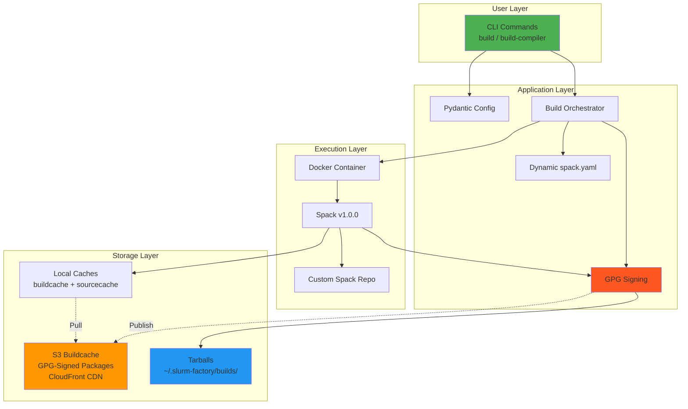

# Slurm Factory Overview

Slurm Factory is a **modern Python CLI tool** that automates building optimized, relocatable Slurm workload manager packages using Docker containers and the Spack package manager. All packages are **GPG-signed** and distributed through a global CDN for fast, secure installations.

## What is Slurm Factory?

Slurm Factory simplifies the complex process of building and packaging Slurm for HPC environments through:

- **Modern CLI Interface** - Typer framework with auto-completion, rich help, and type-safe validation
- **GPG-Signed Packages** - All compiler and Slurm packages cryptographically signed for integrity
- **Public Binary Cache** - CDN-distributed at `slurm-factory-spack-binary-cache.vantagecompute.ai`
- **10-15x Faster Installs** - Pre-built packages install in 5-15 minutes vs 45-90 minutes
- **Automated Build Process** - One-command package creation using Docker containers
- **Relocatable Packages** - Deploy to any filesystem path without recompilation
- **Performance Optimization** - CPU-specific optimizations and optional GPU support
- **Reproducibility** - Docker container isolation and version-controlled dependencies

## Supported Version Matrix

### Slurm Versions
- **25.11** - Latest release (recommended)
- **24.11** - LTS release
- **23.11** - Stable release

### GCC Compiler Toolchains

All toolchains are GPG-signed and available in the public buildcache:

| Version | Target Distribution  | glibc | Status        | Use Case                        |
|---------|---------------------|-------|---------------|---------------------------------|
| 15.2.0  | Latest              | 2.39  | Latest        | Cutting-edge features           |
| 14.2.0  | Latest              | 2.39  | Latest GCC 14 | Modern features                 |
| 13.4.0  | Ubuntu 24.04        | 2.39  | **Default**   | Recommended for most users      |
| 12.5.0  | Latest              | 2.35  | Latest GCC 12 | Good compatibility              |
| 11.5.0  | Ubuntu 22.04        | 2.35  | Stable        | Wide compatibility              |
| 10.5.0  | RHEL 8/Ubuntu 20.04 | 2.31  | Stable        | Enterprise Linux 8              |
| 9.5.0   | Latest              | 2.28  | Latest GCC 9  | Older systems                   |
| 8.5.0   | RHEL 8              | 2.28  | Stable        | Enterprise Linux 8              |
| 7.5.0   | RHEL 7              | 2.17  | LTS           | Maximum backward compatibility  |

### Package Size Matrix

| Build Type    | CPU-Only | GPU-Enabled |
|--------------|----------|-------------|
| Standard     | 2-5 GB   | 15-25 GB    |
| Minimal      | 1-2 GB   | N/A         |

## GPG Package Signing

All packages in the slurm-factory buildcache are **cryptographically signed with GPG** for security and integrity.

### Why GPG Signing?

- **Authenticity**: Verify packages were built by Vantage Compute
- **Integrity**: Detect tampering or corruption during download
- **Security**: Prevent man-in-the-middle attacks
- **Trust Chain**: Establish provenance for production deployments

### GPG Key Information

```
Key ID: DFB92630BCA5AB71
Fingerprint: 9C4E 8B2F 3A1D 5E6C 7F8A  9B0D DFB9 2630 BCA5 AB71
Owner: Vantage Compute Corporation (Slurm Factory Spack Cache Signing Key)
Email: info@vantagecompute.ai
```

### Automatic Key Import

When using slurm-factory or installing from the buildcache, GPG keys are automatically imported:

```bash
# Keys are imported and trusted automatically
spack buildcache keys --install --trust
```

### Manual Key Verification

For production environments, verify the key fingerprint:

```bash
# Import the public key
spack buildcache keys --install --trust

# Verify the fingerprint
gpg --list-keys --keyid-format LONG

# Should show:
# pub   rsa4096/DFB92630BCA5AB71 2025-01-XX
#       9C4E 8B2F 3A1D 5E6C 7F8A  9B0D DFB9 2630 BCA5 AB71
```

### Signed Package Types

All packages in the buildcache are signed:

1. **Compiler Packages** (`compilers/{version}/`)
   - `gcc@{version}` - GCC compiler suite
   - `gcc-runtime@{version}` - Runtime libraries
   - All compiler dependencies

2. **Slurm Packages** (`slurm/{slurm_version}/{gcc_version}/`)
   - `slurm@{version}` - Slurm workload manager
   - All Slurm dependencies (OpenMPI, PMIx, etc.)

## Build System Architecture



## Key Features

### 🔐 **GPG-Signed Packages**
- **Cryptographic Signing**: All packages signed with GPG key `DFB92630BCA5AB71`
- **Automatic Verification**: Spack verifies signatures during installation
- **Trust Chain**: Establish package provenance for production deployments
- **Security**: Prevent tampering and man-in-the-middle attacks
- **Key Distribution**: Public key distributed via buildcache metadata

### 🏗️ **Modern Python Architecture**
- **Typer CLI**: Auto-completion, rich help text, and type-safe command validation
- **Pydantic Configuration**: Type-safe settings with environment variable support
- **Custom Exception Hierarchy**: Structured error handling with actionable messages
- **Rich Console Output**: Colored progress indicators and user-friendly status messages
- **Logging System**: Comprehensive logging with debug and verbose modes

### 📦 **Relocatable Packages**
- **Runtime Path Configuration**: Deploy to any filesystem location (`/opt`, `/shared`, custom)
- **Environment Variable Overrides**: Customize installation paths at module load time
- **Portable Modules**: Lmod modules that work across different environments
- **Self-Contained**: No external dependencies required at runtime
- **RPATH/RUNPATH**: Binaries find libraries without `LD_LIBRARY_PATH`

### ⚡ **Public Binary Cache with CDN**
- **Global CDN**: CloudFront-distributed at `slurm-factory-spack-binary-cache.vantagecompute.ai`
- **Pre-built Packages**: All Slurm versions × All GCC versions
- **10-15x Speedup**: Install in 5-15 minutes instead of 45-90 minutes
- **GPG Signed**: All packages cryptographically signed for integrity and authenticity
- **Secure Verification**: Automatic signature verification with trusted keys
- **No Docker Required**: Install directly with Spack from buildcache

### ⚡ **Intelligent Multi-Layer Caching**
- **Docker Layer Cache**: Reuse base images and build layers
- **Binary Package Cache**: Reuse compiled packages across builds
- **Source Archive Cache**: Downloaded sources stored locally
- **Compiler Cache**: Pre-built GCC toolchains
- **Fast Rebuilds**: 5-15 minutes for subsequent builds (vs 45-90 minutes initial)

### 🔧 **Comprehensive Build System**
- **Two Build Commands**: `build-compiler` for GCC toolchains, `build` for Slurm packages
- **GPG Signing**: All builds automatically signed before publishing
- **Dependency Classification**: External tools vs runtime libraries for optimal sizing
- **Multiple Build Types**: CPU-only, GPU-enabled, minimal variants
- **Compiler Flexibility**: GCC 7.5.0 through 15.2.0 for cross-distro compatibility
- **Automated Publishing**: Push GPG-signed packages to S3 buildcache and CloudFront CDN

## Package Types

| Type | Size | Features | Build Time | Cache Time | Use Case |
|------|------|----------|------------|------------|----------|
| **Default (CPU)** | 2-5GB | CPU-optimized with OpenMPI, PMIx | 45-90 min | 5-15 min | Standard HPC clusters |
| **GPU** | 15-25GB | CUDA/ROCm support | 90-180 min | 15-25 min | GPU-accelerated workloads |
| **Minimal** | 1-2GB | Basic Slurm only | 20-30 min | 3-5 min | Resource-constrained environments |

## CLI Examples

### Using the Public Buildcache (Fastest)

```bash
# Install Spack
git clone --depth 1 --branch v1.0.0 https://github.com/spack/spack.git
source spack/share/spack/setup-env.sh

# Add buildcache mirrors
spack mirror add slurm-factory-compilers \
  https://slurm-factory-spack-binary-cache.vantagecompute.ai/compilers/13.4.0/buildcache

spack mirror add slurm-factory-slurm \
  https://slurm-factory-spack-binary-cache.vantagecompute.ai/slurm/25.11/13.4.0/buildcache

# Import and trust GPG signing keys
spack buildcache keys --install --trust

# Install from signed buildcache (5-15 minutes!)
spack install slurm@25.11%gcc@13.4.0

# Load and verify
spack load slurm@25.11
sinfo --version
```

### Building Locally with slurm-factory CLI

```bash
# Install slurm-factory
pip install slurm-factory

# Build compiler toolchain (one-time, optional)
slurm-factory build-compiler --compiler-version 13.4.0

# Build Slurm (uses buildcache for dependencies)
slurm-factory build --slurm-version 25.11

# Build with specific options
slurm-factory build --slurm-version 24.11 --compiler-version 10.5.0  # RHEL 8
slurm-factory build --slurm-version 25.11 --gpu                       # GPU support
slurm-factory build --slurm-version 25.11 --minimal                   # Minimal build

# Build and publish to buildcache (requires AWS credentials)
slurm-factory build --slurm-version 25.11 --publish=all

# Verbose output for debugging
slurm-factory --verbose build --slurm-version 25.11
```

## Supported Versions

### Slurm Versions

Slurm Factory supports building the following Slurm versions:

- **25.11** - Latest stable release (default)
- **24.11** - Previous stable release
- **23.11** - Long-term support

Use `--slurm-version` to specify which version to build.

### Compiler Toolchains

All GCC compiler versions are built by Spack for maximum relocatability and cross-distribution compatibility. Use `--compiler-version` to select your target environment:

| Version | glibc | Target Distribution | Description |
|---------|-------|---------------------|-------------|
| 14.2.0  | 2.39  | Latest | Latest GCC 14, modern features |
| 13.4.0  | 2.39  | Ubuntu 24.04 | **Default**, good balance |
| 12.5.0  | 2.35  | Ubuntu 22.04 | Latest GCC 12 |
| 11.5.0  | 2.35  | Ubuntu 22.04 | Good compatibility |
| 10.5.0  | 2.31  | RHEL 8/Ubuntu 20.04 | Wide compatibility |
| 9.5.0   | 2.28  | RHEL 8 | Latest GCC 9 |
| 8.5.0   | 2.28  | RHEL 8 | Older distributions |
| 7.5.0   | 2.17  | RHEL 7 | Maximum compatibility |

## Use Cases

- **Research Computing Centers**: Standardize Slurm deployments across multiple heterogeneous clusters
- **Cloud HPC Providers**: Rapidly provision clusters with consistent, tested software stacks  
- **Educational Institutions**: Provide reproducible HPC environments for teaching and research
- **Industry HPC**: Deploy compliance-ready solutions with full audit trails and security
- **CI/CD Pipelines**: Automated testing and validation of HPC software stacks
- **Air-Gapped Installations**: Download buildcache once, deploy offline in secure environments
- **Container Deployments**: Base images for Kubernetes, Singularity, or Docker-based HPC

## Infrastructure

Slurm Factory is supported by a comprehensive AWS infrastructure:

### Components

- **S3 Buildcache Bucket**: `slurm-factory-spack-buildcache-4b670`
- **CloudFront Distribution**: Global CDN for fast buildcache access
- **Route53 DNS**: `slurm-factory-spack-binary-cache.vantagecompute.ai`
- **GitHub OIDC**: Secure, keyless authentication for CI/CD
- **AWS CDK**: Infrastructure as code for reproducible deployments

### CI/CD

Three GitHub Actions workflows maintain the buildcache:

1. **Compiler Buildcache**: Build and publish GCC toolchains
2. **Slurm Dependencies**: Build Slurm packages for all compiler combinations
3. **Tarball Publishing**: Create and publish relocatable tarballs

All workflows run on self-hosted runners with GPG signing and automated testing.

See [Infrastructure](./infrastructure.md) and [GitHub Actions](./github-actions.md) for details.

## Next Steps

- **[Installation Guide](./installation.md)** - Get started with Slurm Factory
- **[Slurm Factory Spack Build Cache](./slurm-factory-spack-build-cache.md)** - Using the public buildcache
- **[Architecture](./architecture.md)** - Learn about the modular design and build pipeline
- **[Examples](./examples.md)** - Practical usage scenarios and patterns
- **[API Reference](./api-reference.md)** - Complete CLI and Python API documentation
