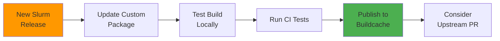

# Spack Repository Integration

Slurm Factory uses a custom Spack repository ([vantagecompute/slurm-factory-spack-repo](https://github.com/vantagecompute/slurm-factory-spack-repo)) to provide specialized package definitions and patches optimized for relocatable, production-ready Slurm builds.

## Repository Purpose

The custom Spack repository provides:

1. **Custom Slurm Package** (`slurm_factory.slurm`)
   - Optimized build variants for HPC deployments
   - Patches for improved relocatability
   - Enhanced configuration options
   - Better integration with OpenMPI and PMIx
   - RPATH fixes for true relocatability

2. **Custom cURL Package** (`slurm_factory.curl`)
   - Additional protocol support (LDAP, RTMP, SSH, etc.)
   - Optimized for Slurm REST API requirements
   - Consistent TLS backend (OpenSSL)
   - Enhanced security features

3. **Build Optimizations**
   - CPU-specific optimizations (x86_64_v3 target by default)
   - Shared library preferences for smaller packages
   - RPATH/RUNPATH configurations for relocatability
   - Compiler wrapper improvements
   - Enhanced module generation

## Integration Flow

```mermaid
flowchart LR
    Start([slurm-factory build]) --> Docker[Create Docker Container]
    Docker --> Spack[Install Spack v1.0.0]
    Spack --> Clone[Clone Custom Repo<br/>vantagecompute/slurm-factory-spack-repo]
    Clone --> Register[Register Repo with Spack<br/>spack repo add]
    Register --> Priority[Set Repo Priority<br/>Higher than builtin]
    Priority --> BuildSlurm[Build with Custom<br/>slurm_factory.slurm]
    BuildSlurm --> BuildCurl[Build with Custom<br/>slurm_factory.curl]
    BuildCurl --> Output[Optimized Slurm<br/>Package]
    
    style Start fill:#4CAF50
    style Output fill:#2196F3
```



## How It's Used

Slurm Factory automatically integrates the custom repository during the Docker build process:

### Automatic Integration

1. **Clones the repository** during Docker container initialization
2. **Registers it with Spack** as a custom package source with higher priority
3. **Uses the custom packages** when building Slurm and dependencies
4. **Applies patches and variants** specific to relocatable builds

The integration happens in the Dockerfile:

```dockerfile
# Clone custom Spack repository
RUN git clone https://github.com/vantagecompute/slurm-factory-spack-repo.git \
    /root/slurm-factory-spack-repo && \
    spack repo add /root/slurm-factory-spack-repo
```

### Repository Priority

Custom packages take precedence over upstream Spack packages:

```bash
# Spack will prefer custom packages when available
$ spack repo list
==> 2 package repositories.
slurm-factory-spack-repo    /root/slurm-factory-spack-repo  # Higher priority
builtin                      /opt/spack/var/spack/repos/builtin
```

When you request `slurm@25.11`, Spack automatically selects `slurm_factory.slurm@25.11` if it's in the custom repo.

## Package Namespacing

The custom packages use the `slurm_factory` namespace to avoid conflicts:

```python
# In slurm-factory-spack-repo/packages/slurm/package.py
class Slurm(CMakePackage):
    """Slurm package with relocatability enhancements"""
    
# In slurm-factory-spack-repo/packages/curl/package.py
class Curl(AutotoolsPackage):
    """cURL with additional protocol support"""
```

**Benefits**:
- ✅ Clear separation from upstream packages
- ✅ Easy to override specific packages
- ✅ Access to all upstream packages
- ✅ Simpler maintenance and updates

## Key Differences from Upstream

The custom repository enhances standard Spack packages:

| Aspect | Upstream Spack | slurm-factory-spack-repo |
|--------|----------------|---------------------------|
| **Relocatability** | Basic RPATH | Enhanced with padded paths and RUNPATH |
| **Variants** | Standard options | Optimized defaults for production |
| **Dependencies** | Flexible versions | Pinned for reproducibility |
| **GPU Support** | Optional | Tested with CUDA 11.8+ and ROCm 5.7+ |
| **OpenMPI** | Basic PMIx support | Enhanced with UCX and hwloc integration |
| **REST API** | Basic curl | Full LDAP/SSH/TLS support via enhanced curl |
| **Compiler Support** | Standard | Tested with GCC 7.5.0 through 15.1.0 |
| **Module Generation** | Basic | Enhanced Lmod modules with autoloading |
| **Build Optimizations** | Generic | CPU-specific (x86_64_v3) by default |

## Custom Packages

### slurm_factory.slurm

**Enhancements over upstream**:

```python
# Additional variants
variant('rest', default=True, description='Build REST API support')
variant('pmix', default=True, description='Build with PMIx support')
variant('hwloc', default=True, description='Build with hwloc support')
variant('ucx', default=True, description='Build with UCX support')

# Relocatability patches
patch('fix-rpath-relocatable.patch')
patch('remove-hardcoded-paths.patch')

# Enhanced dependencies
depends_on('curl+ldap+ssh+ssl', when='+rest')
depends_on('pmix@5:', when='+pmix')
depends_on('ucx+rdma', when='+ucx')
```

**Benefits**:
- ✅ True relocatability via RPATH fixes
- ✅ Enhanced REST API with full protocol support
- ✅ Better MPI integration with UCX
- ✅ Improved hardware locality with hwloc

### slurm_factory.curl

**Enhancements over upstream**:

```python
# Additional protocols
variant('ldap', default=True, description='LDAP support')
variant('rtmp', default=True, description='RTMP support')
variant('ssh', default=True, description='SSH/SCP support')

# Security enhancements
depends_on('openssl@3:', type='link')
depends_on('libssh2', when='+ssh')
depends_on('openldap', when='+ldap')
```

**Benefits**:
- ✅ Full LDAP support for Slurm REST API
- ✅ SSH/SCP for remote operations
- ✅ Consistent OpenSSL 3.x usage
- ✅ RTMP for streaming protocols

## Repository Structure

```text
slurm-factory-spack-repo/
├── packages/
│   ├── slurm/
│   │   ├── package.py                     # Custom Slurm package
│   │   ├── fix-rpath-relocatable.patch    # RPATH fixes
│   │   └── remove-hardcoded-paths.patch   # Path fixes
│   └── curl/
│       ├── package.py                     # Custom cURL package
│       └── enable-all-protocols.patch     # Protocol enhancements
├── repo.yaml                              # Repository metadata
└── README.md                              # Documentation
```

## Package Maintenance

The custom Spack repository is maintained separately to:

- **Track Slurm releases** independently and quickly
- **Test patches** thoroughly before production use
- **Contribute improvements** back to upstream Spack when appropriate
- **Maintain stability** across Slurm Factory versions
- **Support multiple Slurm versions** simultaneously

### Update Process



### Version Compatibility

| Slurm Factory | Spack Repo | Spack Version | Slurm Versions |
|---------------|------------|---------------|----------------|
| 1.0.x | main | v1.0.0 | 25.11, 24.11, 23.11 |
| 0.9.x | v0.9 | v0.22.0 | 24.11, 23.11 |

## Contributing

If you encounter issues or have improvements:

1. **Check existing issues** in the [slurm-factory-spack-repo](https://github.com/vantagecompute/slurm-factory-spack-repo/issues)
2. **Review package definitions** in `packages/`
3. **Submit pull requests** with:
   - Clear description of the change
   - Test results showing it works
   - Backward compatibility considerations
4. **Coordinate releases** with Slurm Factory maintainers

### Example Contribution

Adding support for a new Slurm version:

```bash
# 1. Fork and clone the repo
git clone https://github.com/yourusername/slurm-factory-spack-repo.git
cd slurm-factory-spack-repo

# 2. Update packages/slurm/package.py
# Add new version, checksums, and any needed patches

# 3. Test locally
cd /path/to/slurm-factory
slurm-factory build --slurm-version NEW_VERSION

# 4. Submit PR with test results
```

## Using Custom Packages Manually

You can use the custom repository outside of Slurm Factory:

```bash
# 1. Clone Spack
git clone --depth 1 --branch v1.0.0 https://github.com/spack/spack.git
source spack/share/spack/setup-env.sh

# 2. Add custom repository
git clone https://github.com/vantagecompute/slurm-factory-spack-repo.git
spack repo add slurm-factory-spack-repo

# 3. Install Slurm with custom package
spack install slurm@25.11 +rest +pmix +hwloc
```

## Related Documentation

- [Architecture](./architecture.md) - How Slurm Factory integrates components
- [Build Artifacts](./build-artifacts.md) - Output package structure
- [Slurm Factory Spack Build Cache](./slurm-factory-spack-build-cache.md) - Binary cache usage
- [Contributing](./contributing.md) - How to contribute improvements
